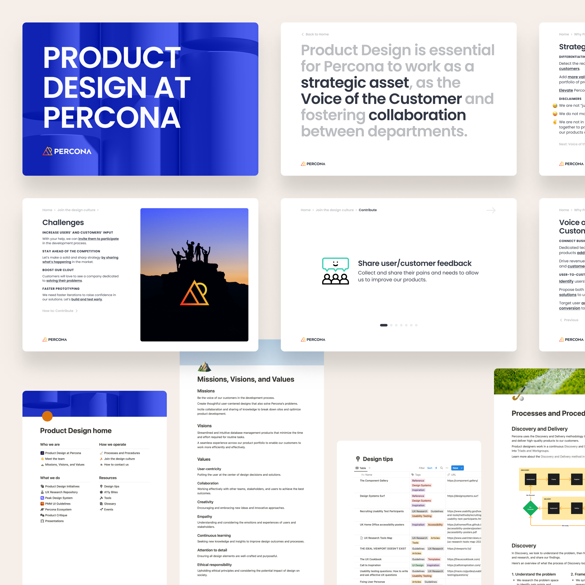

I look into encouraging a design culture within a team, ensuring everyone is empowered to collaborate in crafting solutions that put the user’s needs first. We can do that by simplifying the design processes and presenting them clearly with that innate simplicity.

One way to achieve it is by entrusting all team members to actively contribute to the process. This can be done by providing simple tasks for anyone to pick up and feel part of the design culture, sourcing more evidence of problems, helping with benchmarking, or encouraging a greater participation from the customers and other users of our products and services.

Promoting design cultivates more of our user-centric mindset that can span multiple departments and enable cross-functional collaboration. Delivering valuable services and experiences is something that resonates with potentially anyone in a team. Showing there is a quick and easy way to contribute may be the right incentive to start looking into problems differently and feel a sense of shared ownership over the solutions we can provide to users and customers.