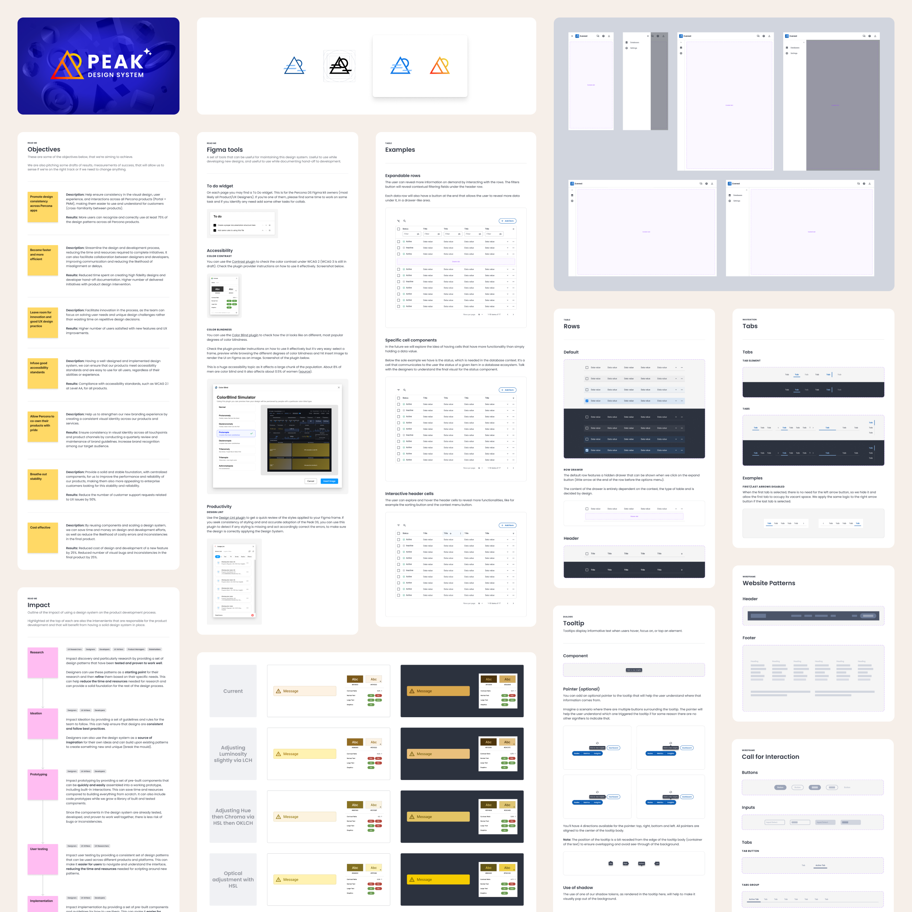

I’ve been dedicated to designing systems for a long time. The Lego-like experience in building them and the systematization intricacies draw me in.

I have helped build a few design systems for web interfaces. I had to make their foundations, design, code some of the components, and test them to be ready for use. I had to set up robust and scalable documentation schemas, allowing partners to use them independently.

Furthermore, I also had the chance to contribute to other matured design systems by complying with their demanding bureaucracy and elevated implementation risks. I used my experience and aptitude to integrate work perfectly into existing brands and elevate their messaging.

I’ve learned much about how invaluable a design system can be to grease the design operations and the manufacturing machine, to move faster, and to propel innovation. My experience here benefits teams looking to build impactful experiences and brands that can scale with minimal regressions but with a powerful face.