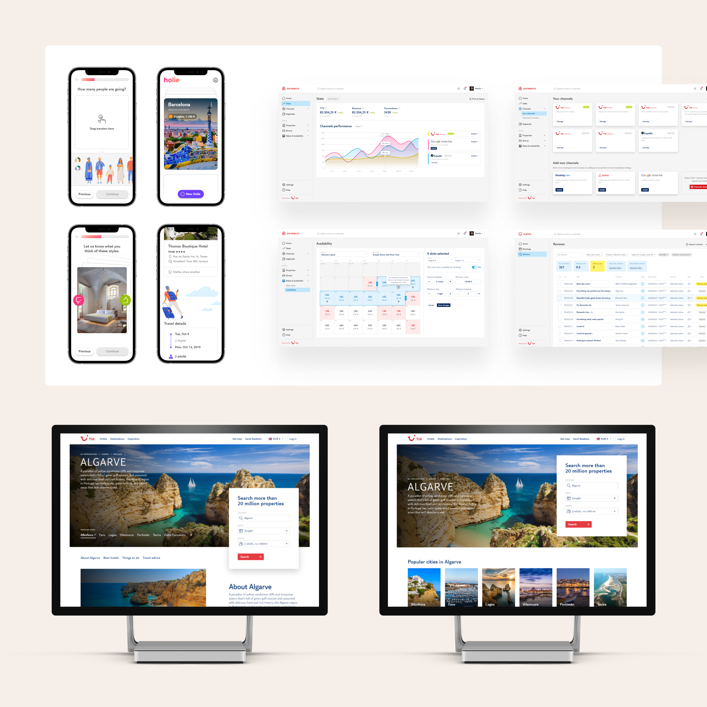
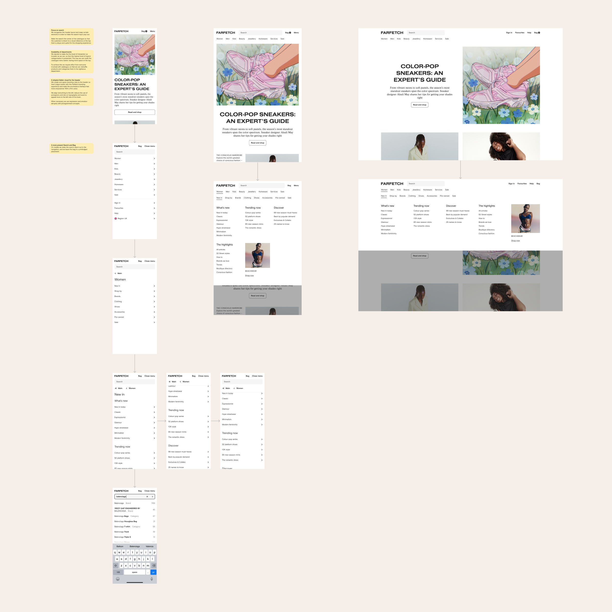

Designing a vision is about foreseeing the long-term horizon for a product or company’s services. I prefer to approach this practice collaboratively by engaging with multiple teams and their experts to consult their thoughts and aspirations and merge a collective vision.

Often, the outcome of envisioning the future is a genuine depiction of what we want to see built. Despite being more theoretical and having some aspects that may not stand the test of time, it still offers a more concrete ambition worth striving for. The discourse concerning our objectives becomes more lucid and motivating around what we want to do to build that vision.

My proficiency with design tools and a quick ideation process enables me to turn these collective dreams into convincing, visual narratives. We can then use them to help navigate the team efforts and serve as a beacon for guiding our strategy with the rest of our services.