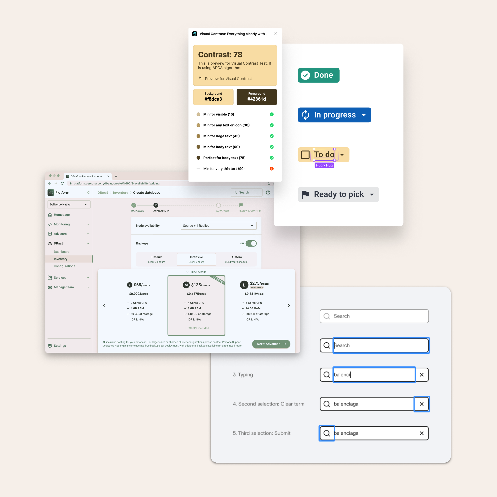

I view this as an exercise in redesigning the bones of a product. It is the big-picture framework for visualizing the interaction between humans and software products.

I approach information architecture from an object-oriented perspective, as it helps align hierarchy, navigation structures, and taxonomy in a way that makes more sense to people in their daily lives. It results in a more clicky and instinctive result.

With this, we trim the complexity and get a more intuitive user journey. But to make sure the output is effectual, a cross-functional collaboration is needed since most product servicing concepts draw from operational structures and the team's know-how.