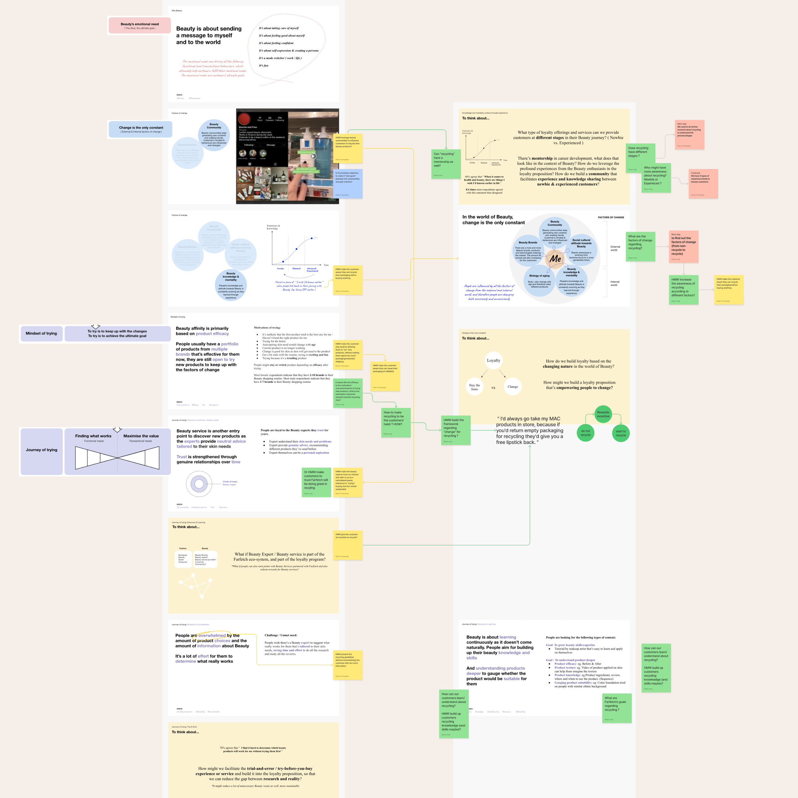

Like a true detective, I search high and low, left and right, and across all departments to find the root problems. I arrange collaborative sessions with experts, users, or customers to gather relevant insights.

The main objective of this type of exercise is to listen. Understand the problem clearly without coming close to premature solutions. Collect the evidence so we can then condense it into valuable insights.

I’ve led many interviews and focus groups, and, with my experience, I can help unveil those nuanced user needs and help the team drive toward design solutions that are more closely aligned with the real world of people trying to understand products in their daily lives.

<small>One quick strategy would be to go through the same steps the user would. Then, capture the screenshots to analyze, with a critical mindset, by stepping back and seeing what users have to face. If available, checking session recordings or similar artifacts will help provide additional clues on how they interact with the product.</small>

<small>Another way would be to collect qualitative and quantitative data to find hints about the user’s experience. Industry experts, like from the support teams, can be an excellent complement to the data, or in the lack of it, to share first-hand perspectives on how users express their problems.</small>