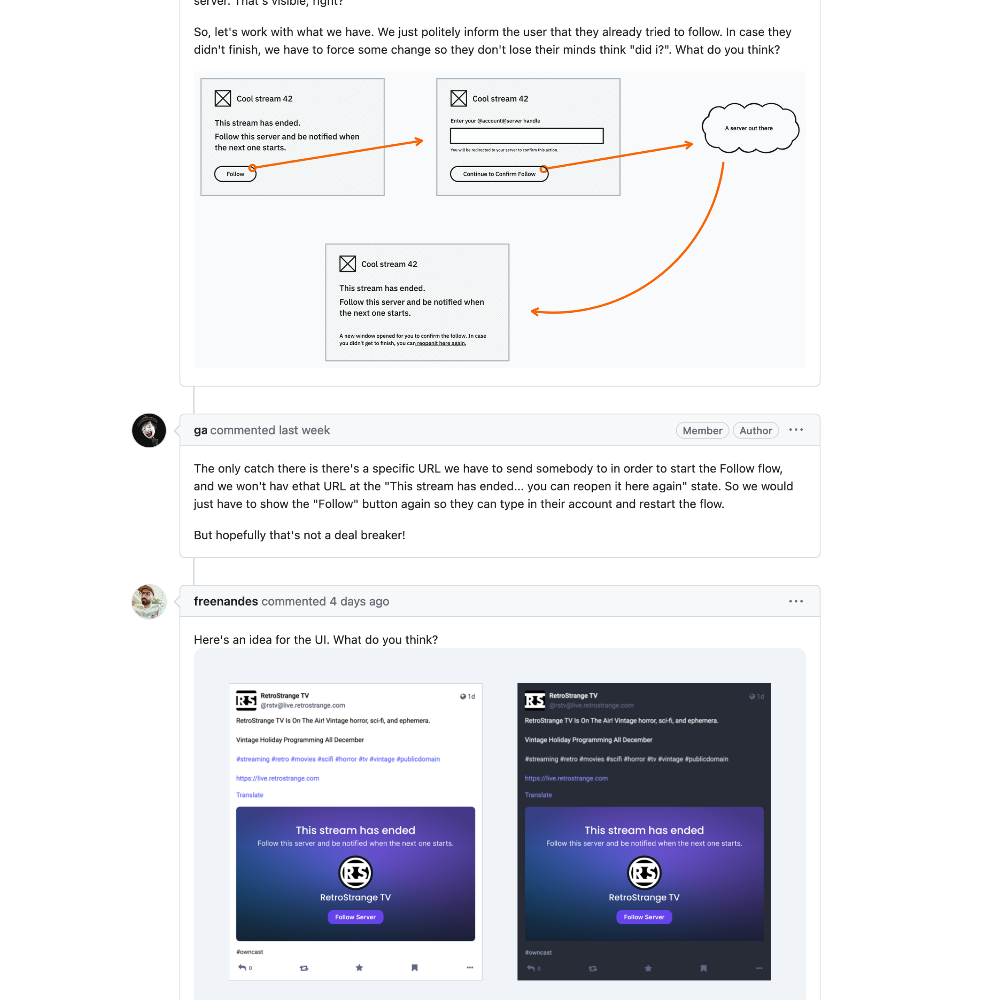

I like open-source software. I feel the benefit of using it on my personal digital devices. I always trust more in the collective effort of doing good in the form of software. Not just because I appreciate the honesty and the humble hard work of the “open-source people” — who I feel are somehow like me and share my vision of a better world. But also because I appreciate the transparency they deliver in their code, making me more confident that I’m using something that is not harmful just for greedy reasons.

This is why I like to contribute to multiple open-source projects. I delve into the communities to help solve other users’ problems. I help pick up issues I can help solve by designing new features. Also, engage in discussions about what the best font to use is and why. Or explain catalog styles spawned during the eighties. Browse my old design books, scan them, and share them to inspire new features. Overall, I will do my best to make products better for the community within open-source projects.