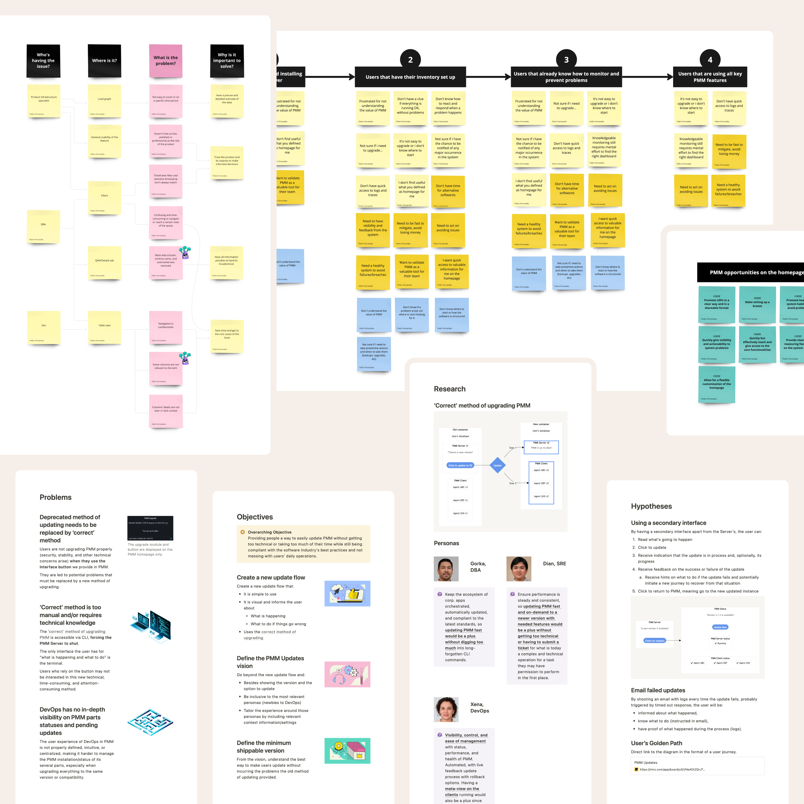

Complex issues require collaborative effort. With some of the research done, a round and more precise view of the problem is necessary to move forward. Shaping a bold problem statement is a powerful way to find opportunities, improve, and objectively confirm all the hype generated around it. It’s because it enables an inspired collaboration.

My goal with the problem framing is to ensure we’re all on the same page to make a positive impact. Getting into hypothesis generation is a breeze with this type of synthesis. It proves, once more, that systematic work is a brilliant way to propel innovation rather than waiting for the eureka moment to drop from the sky.

Whatever “detective” work was done, I make sure we have a problem well-defined, digested, and focused on the essence. We can also use it as a communication asset and invite more people to help solve it. It’s a positive way to incite teamwork and co-own solutions.