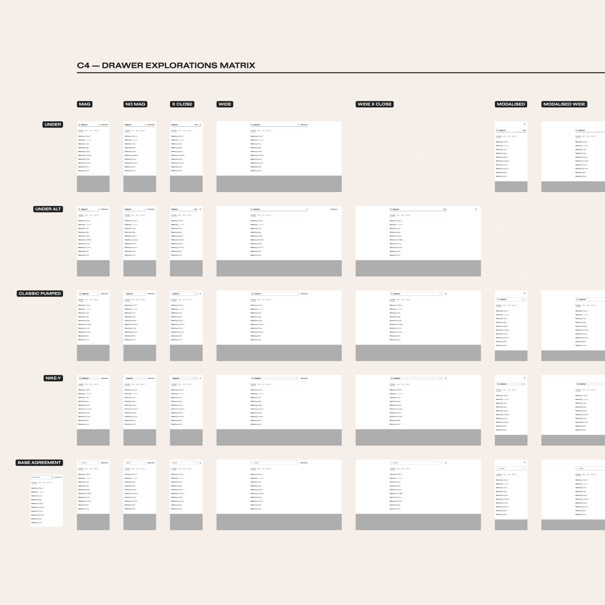
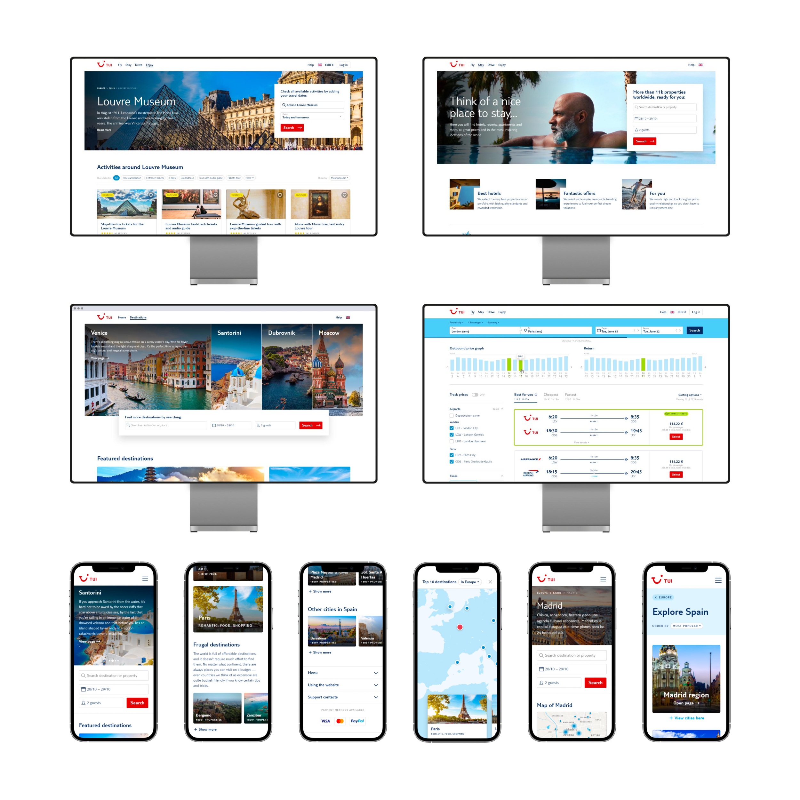

This stage is crucial to understanding the final solution. Many adjustments are made at this point. Depending on the project’s complexity, I can create quick, high-fidelity prototypes with typical graphical design tools. These prototypes aid the team in testing the usability and give us more confidence in the implementation.

Alternatively, I can dive directly into code and create something that can provide realistic data when tested while allowing us to get halfway into a swifter implementation.

My design approach is always grounded in understanding the technical intricacies. Collaboration with the engineering team is pivotal as we explore feasible routes to bring our design vision to life. By engaging with the technology and understanding the established code architecture, I aim to carve out compelling and implementable design solutions, making design a valuable asset in bridging ideas with practical implementation.

