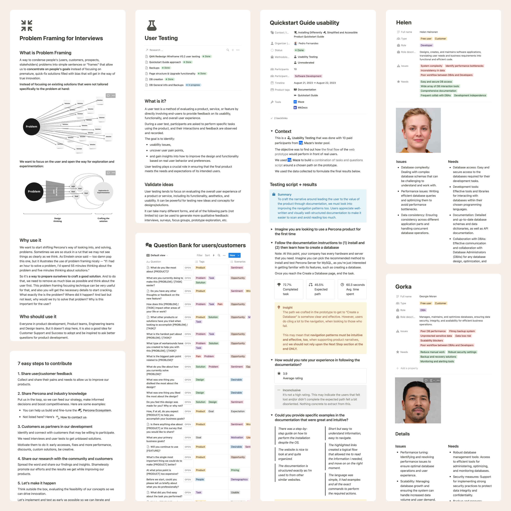

Documenting research outputs is essential for building team knowledge. Not just organized text but an orchestrated conjunction of text, diagrams, and drawings that help to effectively communicate the problems, opportunities, potential solutions, maybe just ideas, the people’s needs, the business objectives, and more.

I look into promoting that knowledge, outline the processes that take the best out of it, and feed it, so the team can keep a continuous improvement culture around the product. With a good research repository, we can make data-driven decisions and infuse user-centricity into what we do.