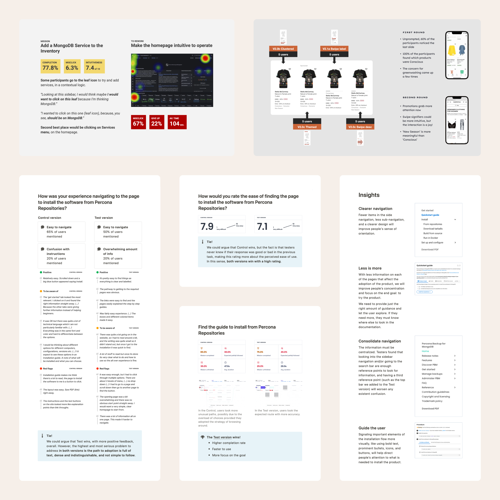

I always see this as a humbling and enlightening process that provides a window into the product’s performance. It allows us to remove any lingering doubts and uncover issues that may have been previously overlooked. I am confident that a round of usability testing is crucial and unavoidable before shipping anything, and it’s my final argument before committing to any design. Still, I know it’s a vastly ignored step in the tech industry due to pressure from multiple sources.

One of my tricks — nothing fancy — is to test as fast as possible. I have perfected my practice with it and ensured we quickly get the juicy insights. We get it every time: a) we did a good job, but we also buy more time to iterate, or b) we gladly declare that everything was excellent and ready to go.

Practice makes it perfect. I can quickly sketch some good critical questions or tasks for the testers. Make sure I get fast to synthesizing the insights. I have perfected my way of dropping the useless and attacking the golden insights. Ultimately, it’s also an excellent opportunity to condense the results into numbers that help us decide quickly. Analyzing the efficacy, trends, and patterns becomes even more helpful when we increase the sample size.