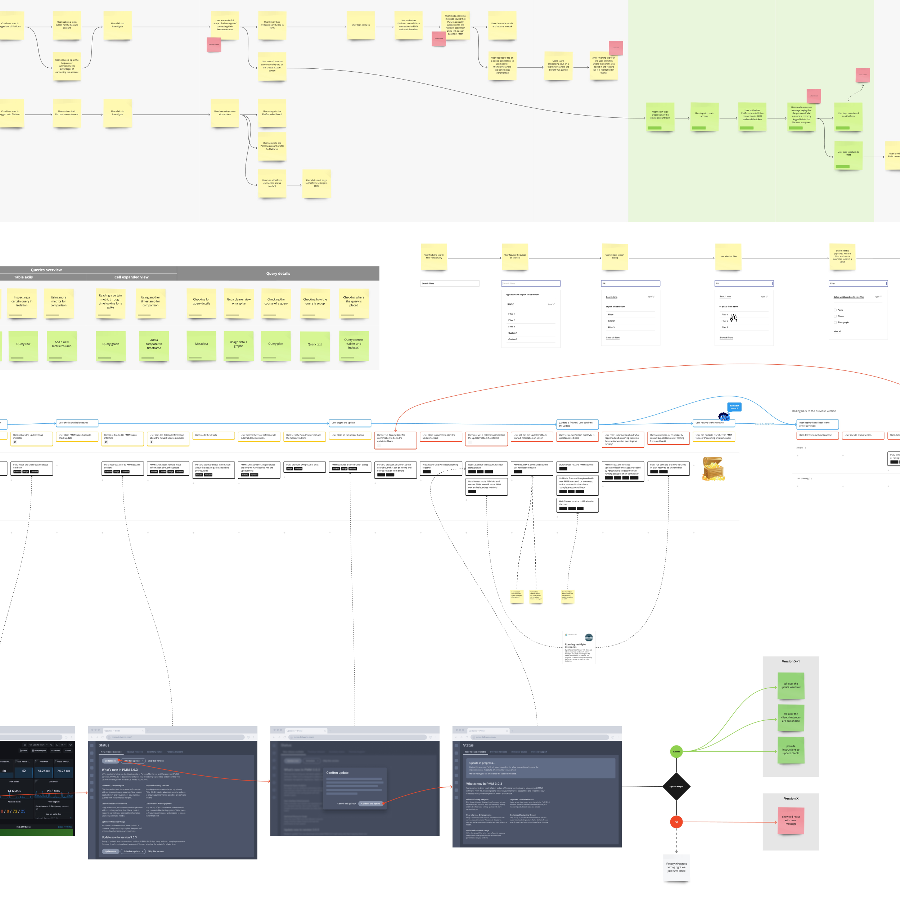

As a product designer, prioritizing the user’s experience is crucial. One of the most effective ways to demonstrate empathy is to map out their journey(s) and understand how users interact with our product. This process enables designers and the rest of the team to identify opportunities to improve the experience and iterate the solution to mitigate any weaknesses.

I look into creating diagrams, journey maps, golden paths, and any other technique we can discover that can capture the essence of the user’s feeling, whether frustrated or delighted, so that we can design a better service through our product.