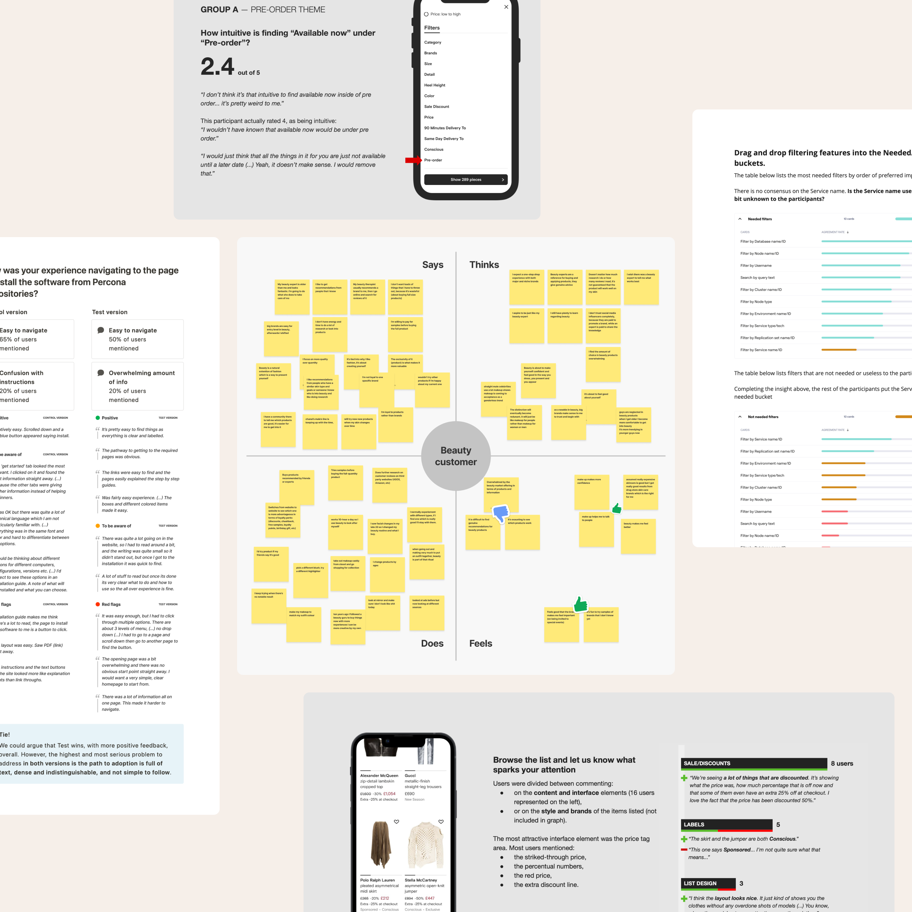

I find that talking with people is a crucial and insightful method to help unlock ideas. It inspires the team and makes communication between us easier when trying to solve a problem. We get to gather around the real-life experiences of our users and their needs, and we feel closer to these. We are solving this for ourselves rather than just for “them”.

For example, we can quickly venture into people’s minds with an act as simple as just making a test. We get to test concepts and wild ideas and generate new ones. It’s a creative practice that validates our thoughts and often leads to building a rich ground for more brainstorming, making the team more open to experimenting and iterating on what’s already on the table to improve the solution and ship a killer feature or product into the market.

I’ve seen how powerful this can be for collaboration, so I am motivated to use my organizational and documentation skills. I look to summarize and extract the relevant insights, make the evidence transparent, and ensure we get the essential learnings that allow us to go on the right track.