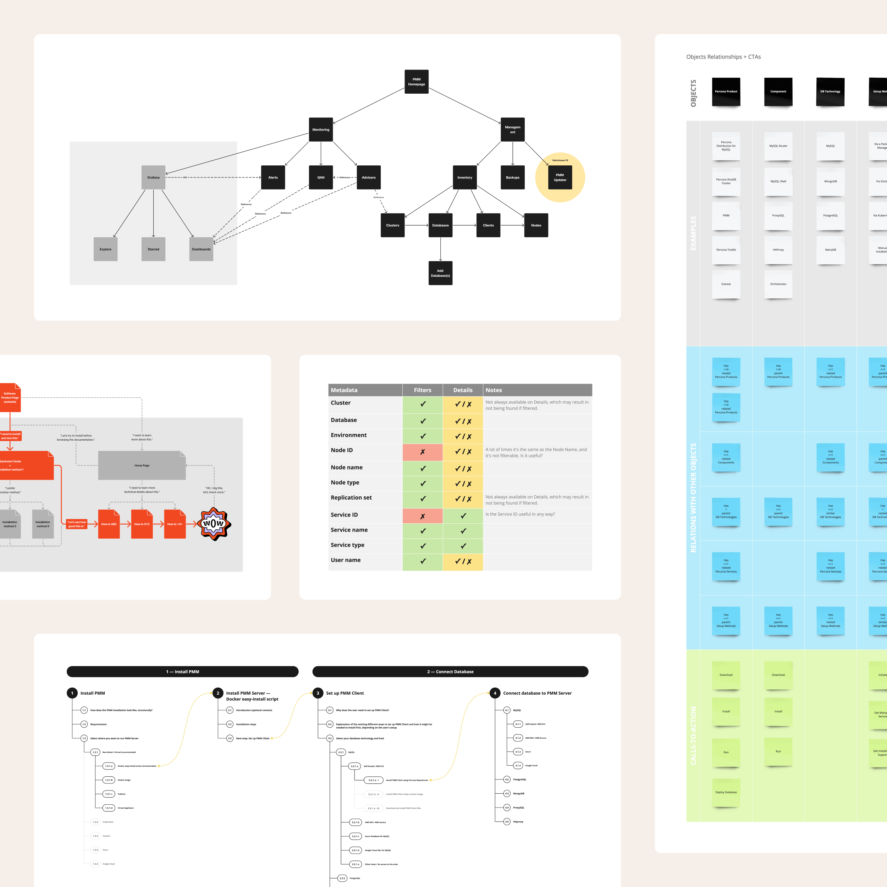

I view the architectural work of structuring the user experience as an exercise in defining the bones of a product. It’s one of the most potent ways to help build an exemplary product.

By doing this, we get to influence more than just the front-end development but also the database creation, the back-end development, the content design, the sales of the product, and more. Doing the architecture of a product helps us bind everything together so that the experience is fully cohesive for everyone, not just the end user.

Everyone responsible for building and selling the product will get to collaborate and establish a better groundwork to build components focused on the user’s experience. It’s beyond just solving technical problems for the challenge. It’s a directed effort from all fronts to make sure the product is suited for people.

I approach the organization of information structures from an object-oriented perspective, as it helps align hierarchy, navigation structures, and taxonomy in a way that makes more sense to real people. It results in a more clicky and intuitive result. A cross-functional collaboration is needed to ensure the output is productive since most product servicing concepts draw from operational structures and the team’s know-how.