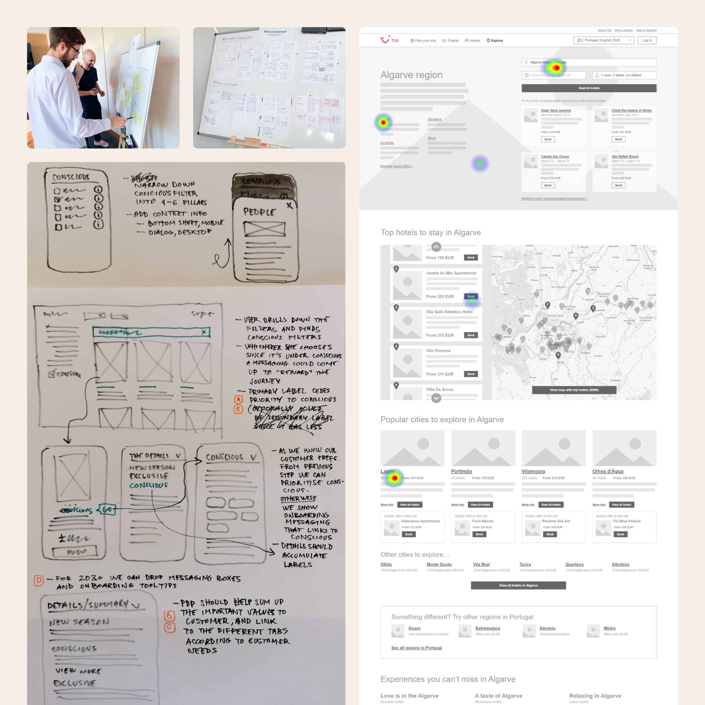

I have it easy with wireframing. I have some drawing skills that allow me to pass ideas onto paper or digital canvases quickly. My brain works graphically and knows what to draw before drawing. It’s my thing; I speak better in images and graphical markings.

In a team gathering, it is easier to discuss solutions to a problem, like a design, and propose changes when the starting point is also visual. Everyone has a say in what they see, and possibilities can arise. I often facilitate these brainstorming sessions as both presenter and moderator, paving the way for a more constructive dialog and helping iterate more efficiently.

We also get the excellent opportunity to test with a wireframe. These visual artifacts serve as a communication tool with potential users and customers, providing us with a better understanding of what they like or dislike about our products.