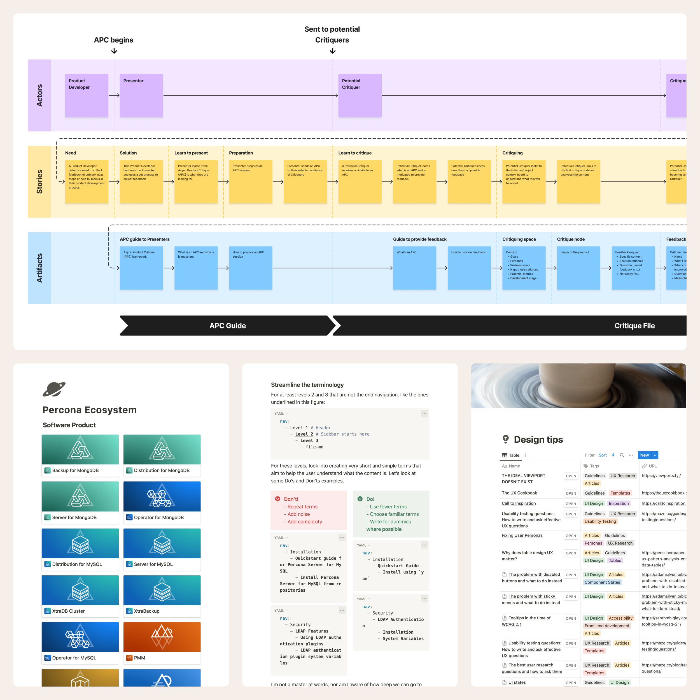

Working with a concerted team is excellent. I have seen and benefited from organized work. When everyone understands each other, and the communication is clear, all flows well, and everyone is happy.

I have grown in this area and know what it takes to help clarify the work we do. I resort to my schematization, documentation, and presentation skills to keep everyone on the same page about my team’s or individual contributions. Ultimately, it boils down to effective communication, and I look forward to having that simple rule in mind.

I also look from afar to contemplate the more extensive workflow and detect opportunities for improvement in our team’s flow or in the company’s servicing. I like to research and be on the lookout for the newest tools, references, heuristic strategies, best practices, toolkits, templates, and other materials that come in handy to make work more focused and efficient.

The truth is that I have always liked structured and systematized outputs. This is why I have developed design systems contribution workflows, critique templates, documentation, procedure schemas, and anything needed to improve the impact of design in making better products.