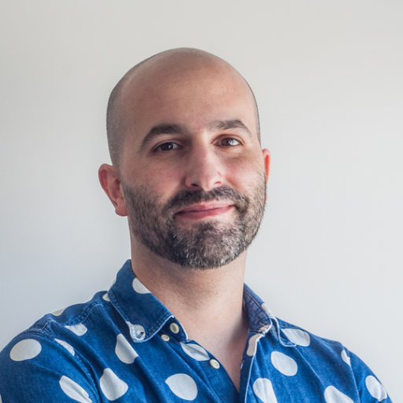

# Pedro MC Fernandes

## Product Designer 
 

[Contact me at www.pmcf.xyz](/) 
<a href="https://linkedin.com/in/pmcfernandes" target="_blank">linkedin.com/in/pmcfernandes</a> 
 

Hi, my name is Pedro, and I'm a designer, a creator inspired by art and creativity. I want to contribute to building a more accessible and humane tech world. While I have experience working in various industries, my focus has been on information technology. I aim to design better experiences that help humans overcome personal and social problems and live healthier and more caring of future generations.

### 9+ years as a digital Product Designer

<small>
    Since 2013 at Percona, Farfetch, TUI Group, Smartidiom, and Noise Goods.
</small>

I worked in Design Operations and Design Systems, setting up processes, documentation, facilitating cross-collaboration, and boosting design impact and efficacy. I also worked hands-on in User Experience Research and Design, crafting digital solutions to recurring and critical user problems. I have worked in Experimentation and User Testing to shape products in a better direction. And I also worked on influencing Back-end architecture and crafting Front-end Development bits to complete our vision and prepare us for a smoother implementation.

### 9+ years of Design systematization

<small>
    Since 2007 at Percona, TUI Group, Smartidiom, and Comopi.
</small>

I prioritized the systematization of Design for a more predictable, organizable, and cost-effective way of working. With this working framework, we guaranteed coherence and surfaced more innate intuitiveness in products. I focused on centralizing and minimalizing information, processes, assets, and artifacts that were polished and acted as building blocks for the now and then for the later of the product development.

### 6+ years of mentorship

<small>
    Since 2007 at Percona, Farfetch, TUI Group and Comopi.
</small>

I played a mentorship role in hiring and welcoming new colleagues. I helped onboard, lead, and motivate them to share their ideas and opinions early on with stakeholders and colleagues. I made myself available to them to give and receive feedback and help them when needed.

### Around 16 years of much more Design

<small>
    Since 2007 as a freelancer and at Smartidiom, Noise Goods, Stricker, and Comopi.
</small>

I worked as a visual, graphic, print, web, interior and industrial designer and illustrator for the arts, press, editorial, photography, web design, advertising, cabinetry, and many other industries.