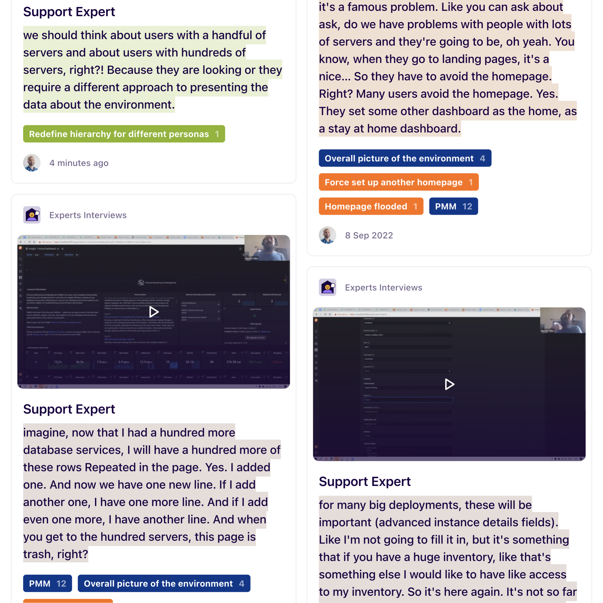
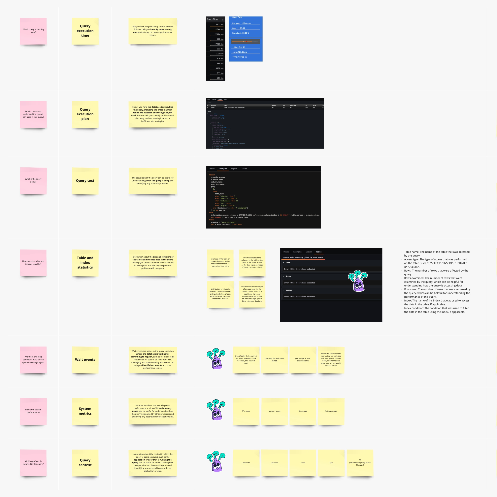
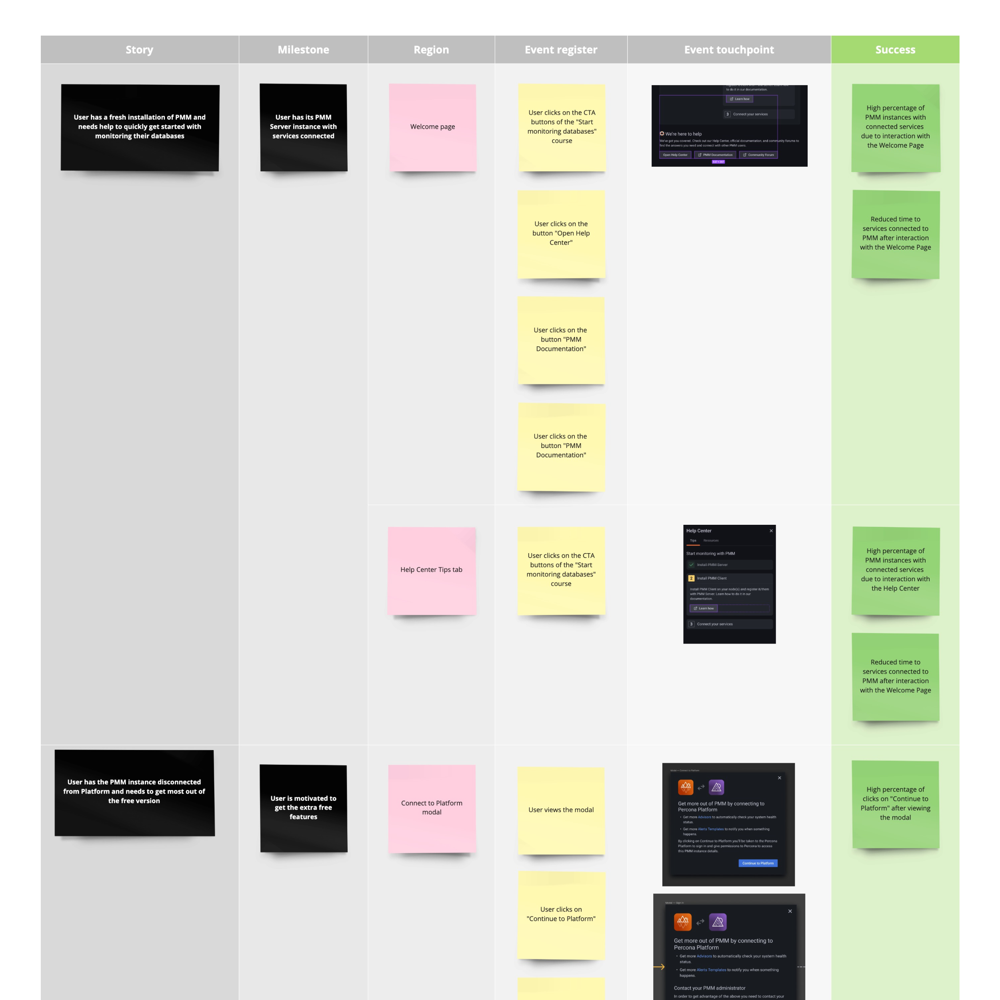

### How do you approach the research phase?

I advise starting with a data-driven approach. To see what we have, I reach out to other departments or colleagues to get their points of view on the users/market and get empirical data. This usually leads to ideas on where or how to source more factual material or evidence.

I explain why and how we use the data, so everyone can be on the lookout for any changes or generate periodic reports interlinked to any ongoing problems. This data and reports will become handy once we change or launch a new product.

    <video width="1250" height="1250" autoplay loop muted playsinline>
        <source src="/videos/design-presentation.mp4" type="video/mp4">
        Your browser does not support video...
    </video>
    <small>Exposing how design operates and the benefits of cross-functional work is essential to kickstart collaboration between departments.</small>

---

This would be the first step to approach the research phase. More is definitely needed, and we haven't started to talk with potential users yet, which can be next.

We may need to go back to experts and users again to validate assumptions and tracking of success through interviews and tests. I usually map all collected information to facilitate the analysis of experts and stakeholders to have a shared understanding of our direction.

