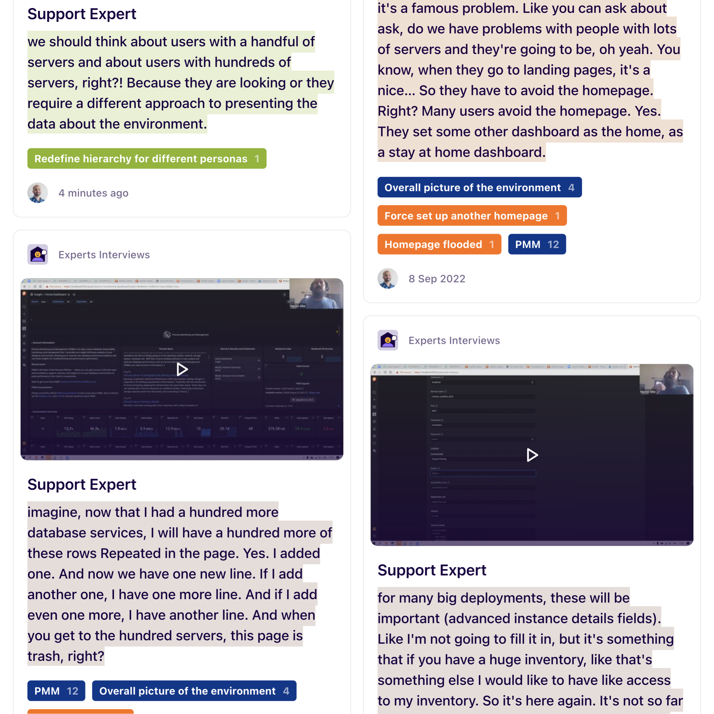
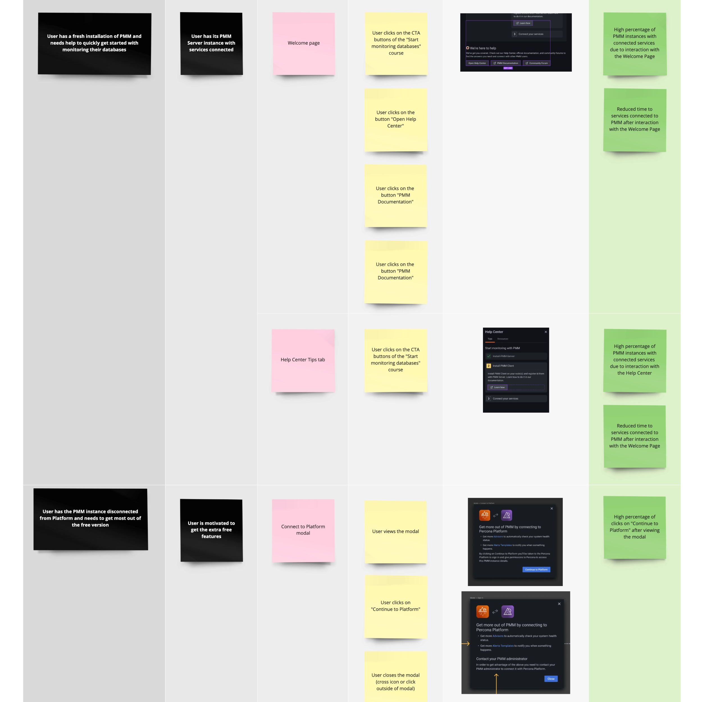

### How do you approach the research phase?

I advise starting with a data-driven approach. To see what we have, I reach out to other departments or colleagues to get their points of view on the users/market and get empirical data. This usually leads to ideas on where or how to source more factual data.

    <video width="1250" height="1250" autoplay loop muted playsinline>
        <source src="/videos/design-presentation.mp4" type="video/mp4">
        Your browser does not support video...
    </video>
    <small>Exposing how design operates and the benefits of cross-functional work is essential to kickstart collaboration between departments.</small>

I explain why and how we use the data, so everyone can be on the lookout for any changes or generate periodic reports interlinked to any ongoing problems. This data and reports will become handy once we change things or launch a new product.

---

I also collect the data points on a whiteboard. I map this information and connect it to the designs to invite everyone to participate and iterate. This approach requires a well-organized board to help colleagues to navigate and understand what's there and correlate data and solutions.