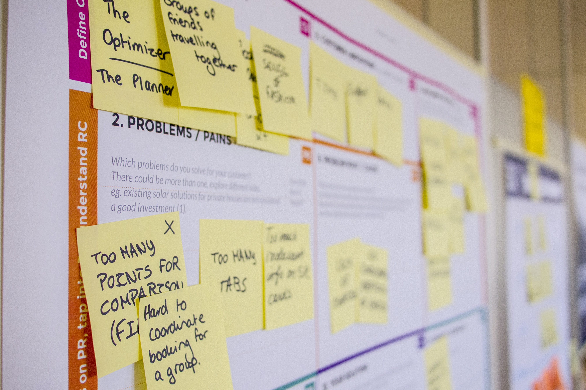

### Have you found user research to provide a positive impact on your work?

User research has been essential to me as a product designer. I gain valuable insights, empathize with users and better understand their problems and needs, allowing me to create genuinely user-centered designs.

I can identify pain points and usability issues and understand where the opportunities are. By interpreting the findings effectively, we can make more informed design decisions and iterate before implementation.

It also helps me validate initial assumptions, weed out personal bias, and get to test with real users. This interaction is precious and eye-opening. And this iterative approach also allows me to refine and optimize the designs and get solid foundations for the product's user experience.

