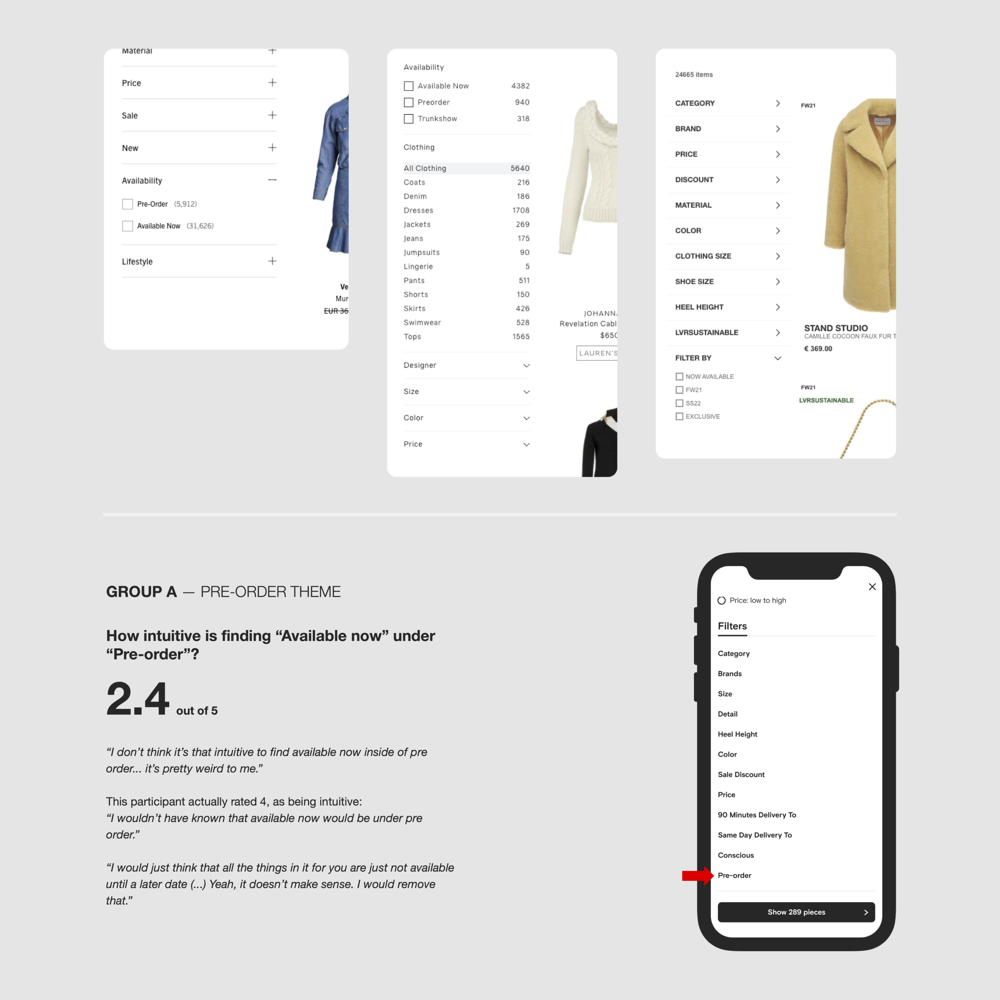

### Have you found user research to provide a positive impact?

User research has been essential! I gain valuable insights, empathize with users, and understand their problems and needs, allowing me to create user-centered designs.

I can identify pain points, usability issues, and innovation opportunities. Interpreting the findings allows us to make more informed decisions and iterate confidently. We can reduce risk, increase the likelihood of success and provide a competitive advantage to the company.

It also helps me validate initial assumptions, weed out personal bias, be more inclusive, and get to test with real users. It's eye-opening. It allows me to refine and optimize designs, build a solid user experience, and drive satisfaction.