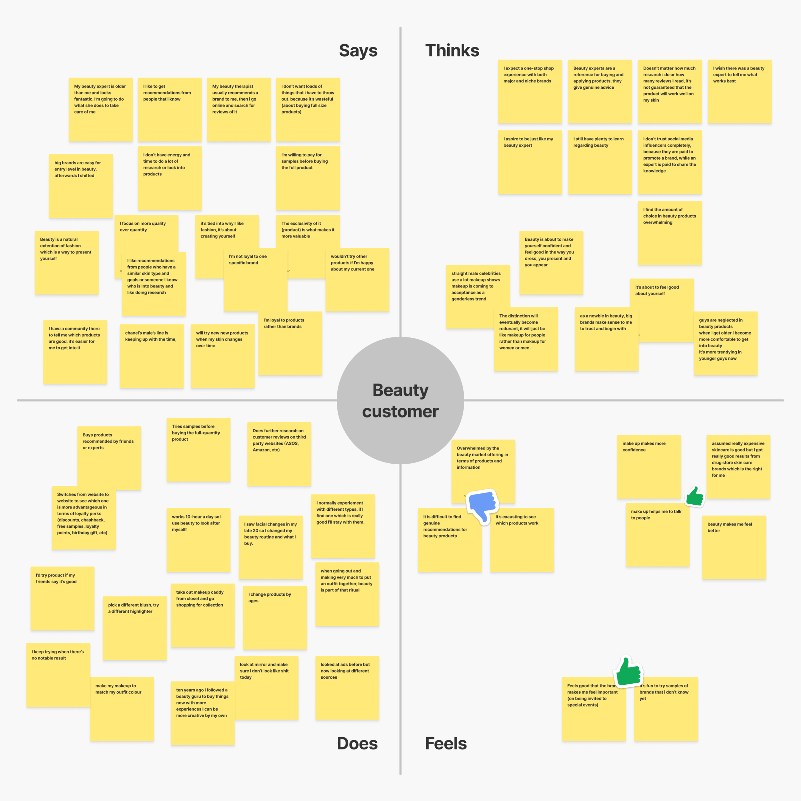
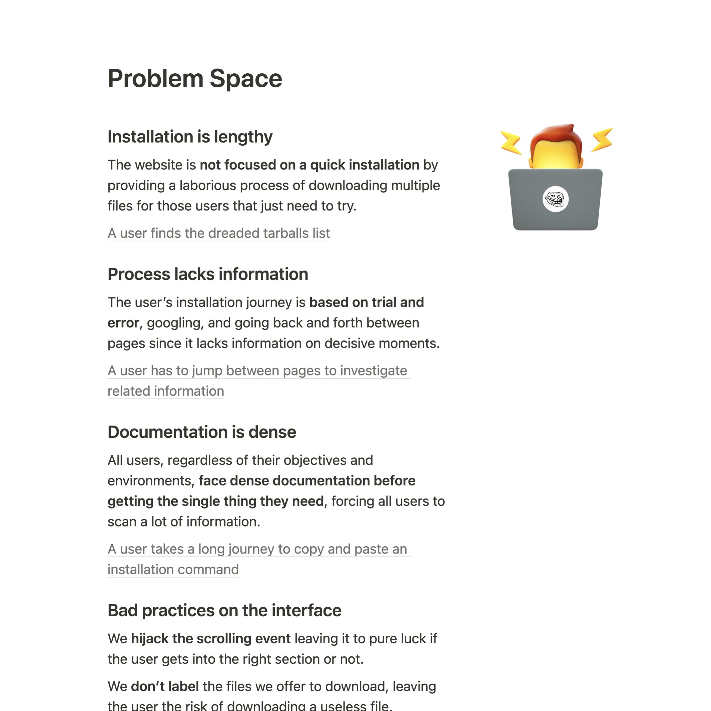
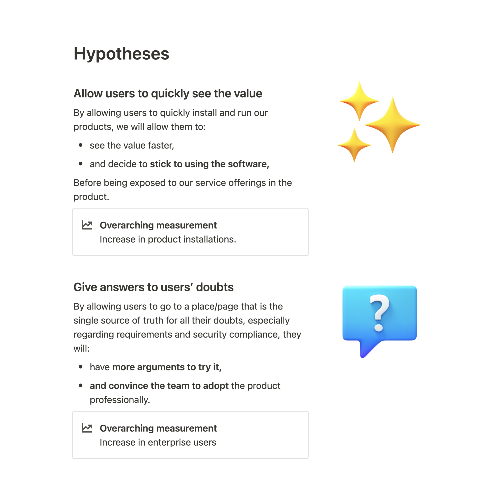

### How do you balance user needs and business goals?

An early data view of the users is crucial. Allows me to get vital information on how we can succeed without going blindly and prematurely into a solution. With enough early research, we can create an execution plan aligning with business goals and motivating stakeholders.

I think keeping straightforward communication throughout the design process is also essential. Leaving an open channel, transparent documentation, and inviting as many business partners as possible to review what we are building.

In my view, it's essential to build that working group. People that understand the problems we're facing and then co-own the same vision for what we're doing. It allows for a shared understanding and a more collaborative process around those business goals.

---

This process is crucial because I don't believe in generic business goals that come out of thin air. For a successful user-centered product, at least a good foundation of user research is needed to inform and break down those goals into something more tangible.