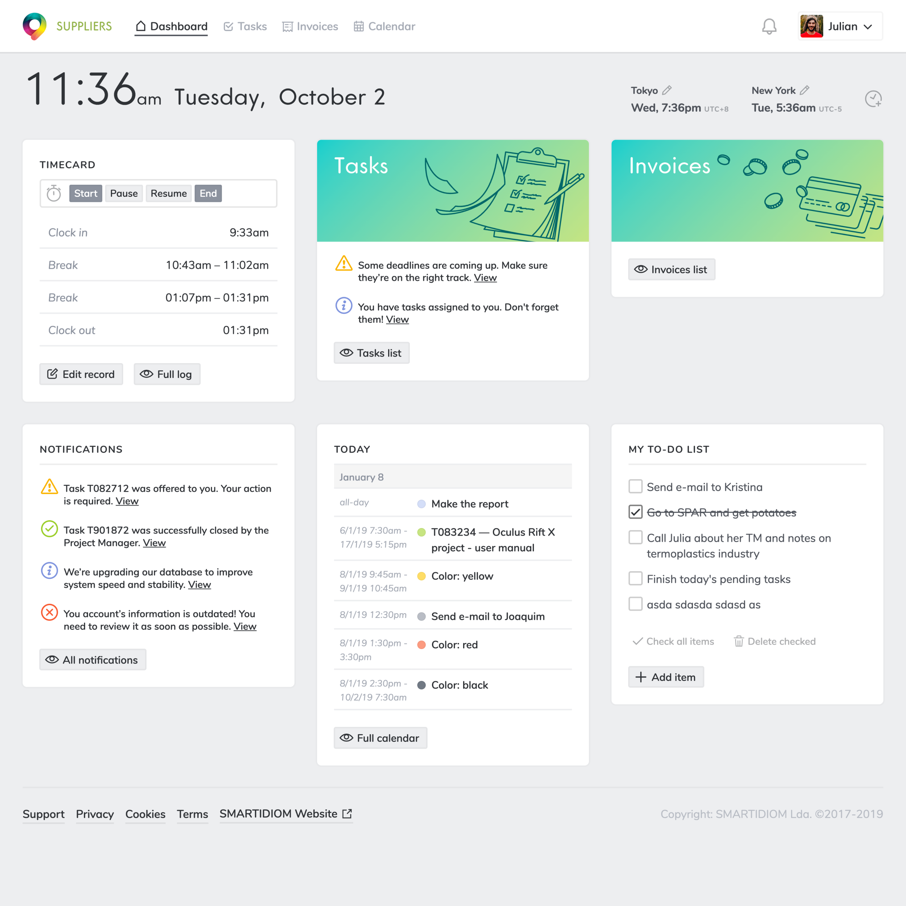
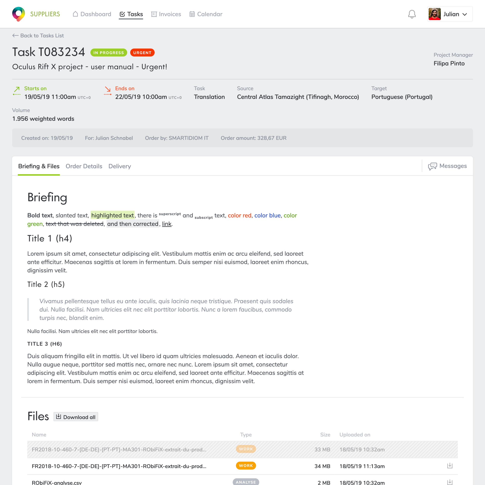
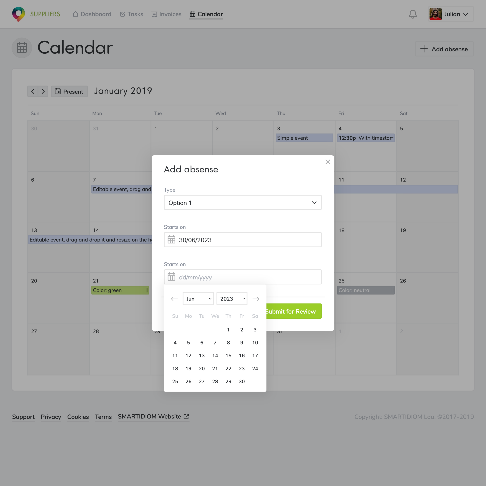
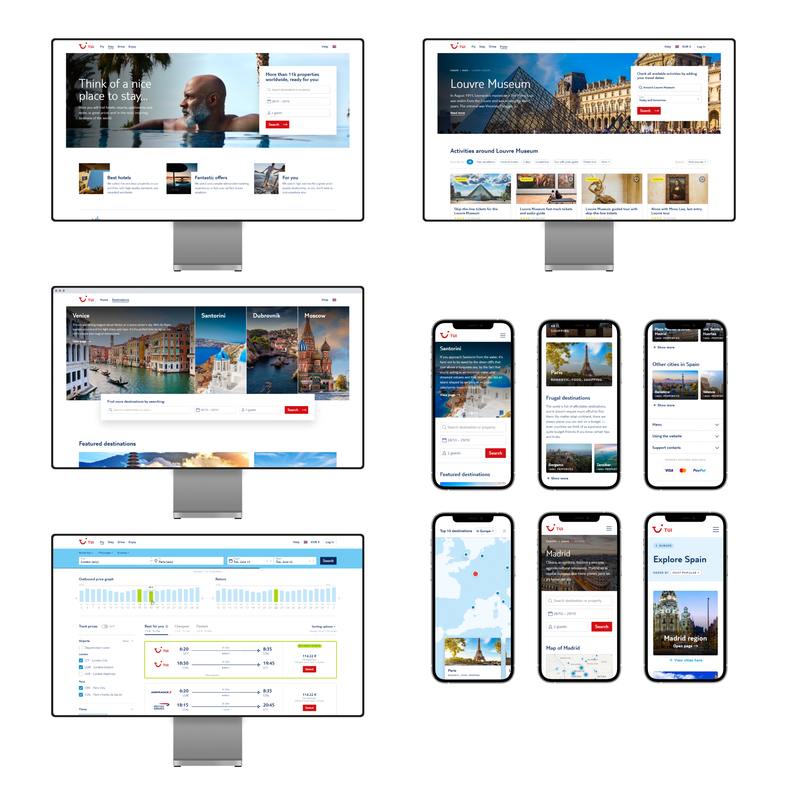
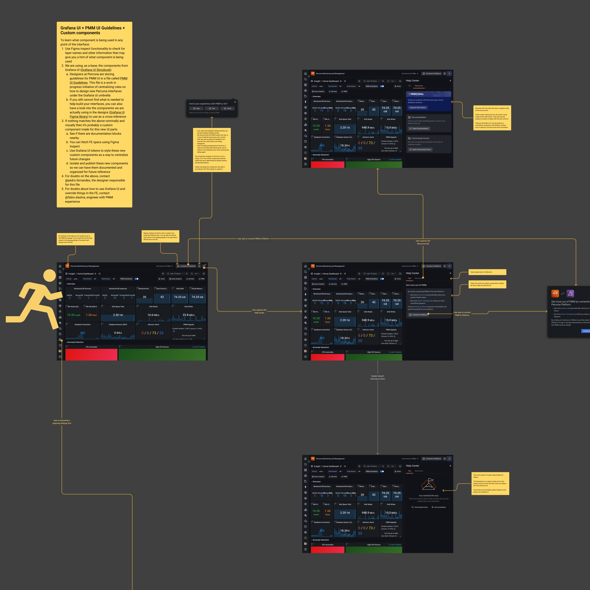

### What do you use for prototyping and how do you iterate?

It depends on speed and accuracy. Usually, I decide on using the design tool we have at hand. Almost any tool works, really. Especially if we’re OK with a wireframe-style prototype, even a sketch on paper will suffice. Whatever can get us, as a collective, into feedback and some data, fast.

Code prototypes are more accurate, however. Implementing them can take longer, but it’s perfect for more complex problems. A code prototype with a wide array of interactivity will output high-quality data when testing and is helpful, in the long run, to ship faster.

---

While getting these prototype artifacts out, I usually set up collaborative sessions within the team or with some internal guerilla tests. This way, I can gather diversified views on the materialization of the solution.

    <video width="1250" height="1250" autoplay loop muted>
        <source src="/videos/stay-mobile.mp4" type="video/mp4">
        Your browser does not support video...
    </video>
    <small>A high-fidelity prototype lets us get more precise data from tests with external users and enables a smoother front-end delivery.</small>

Iterating involves incorporating collected decisions into a new version of the designs and then having mechanisms to share that again with the team quickly. We can use that new version even for subsequent rounds of testing or, if we're already confident, directly to implementation handoff.

