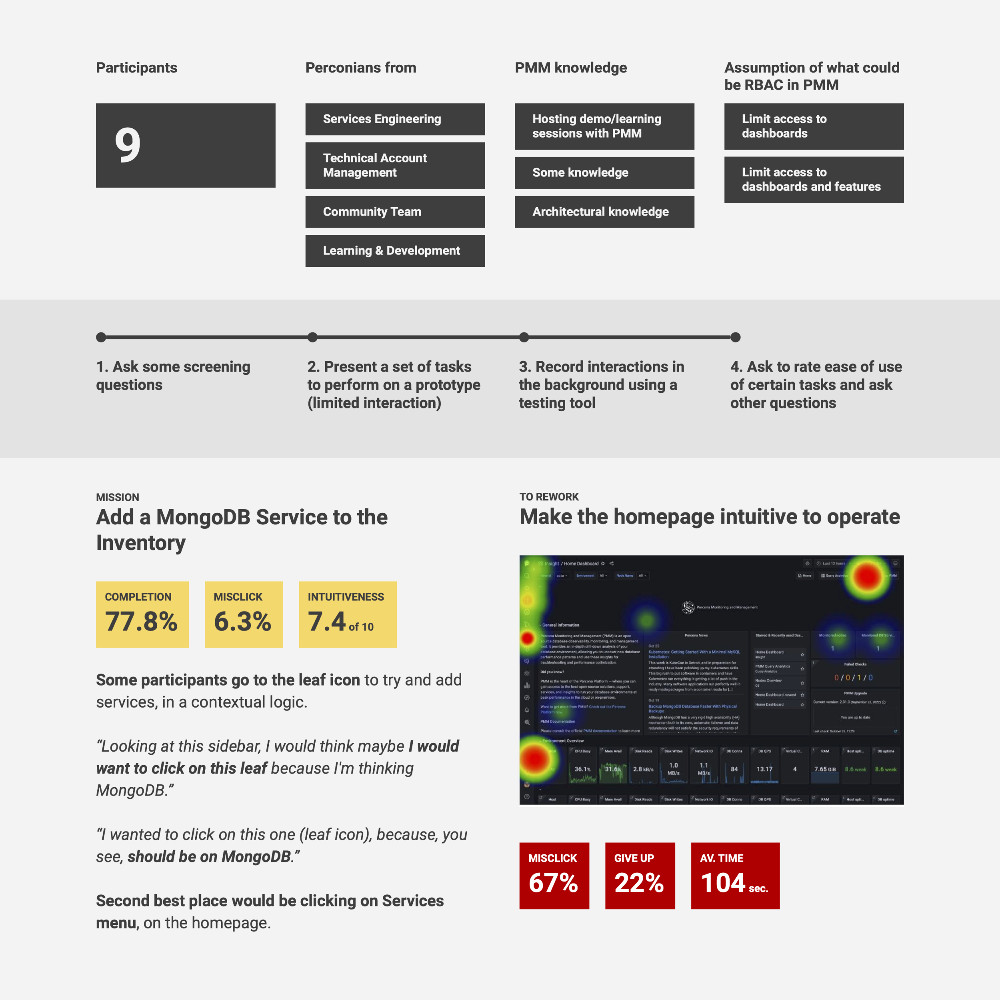
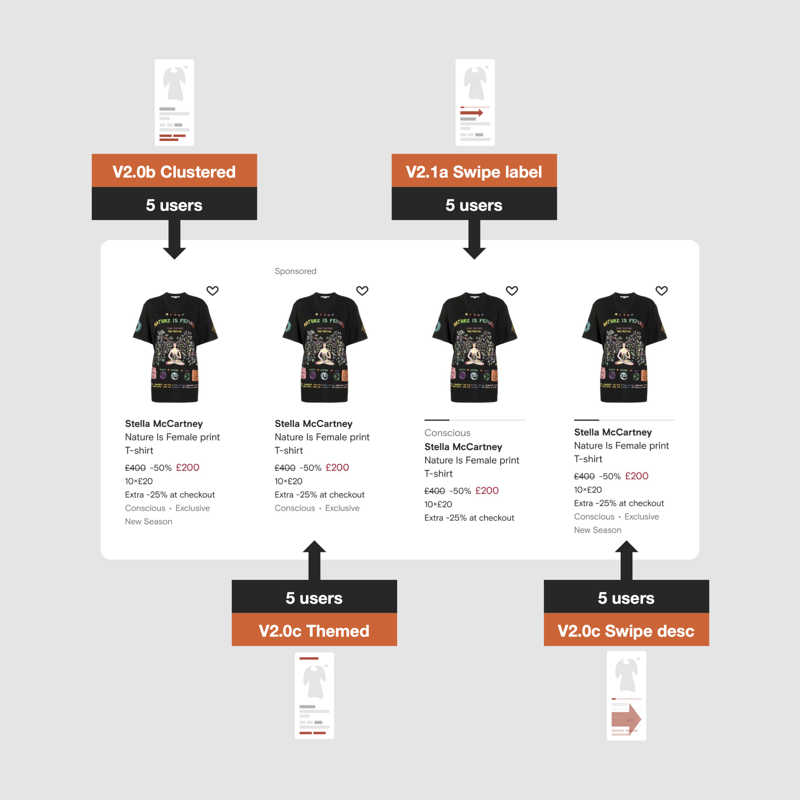

### How do you approach testing and validating designs?

If we want to go fast, I go with internal testing. Valuable input can be obtained from specialists, engineers, customer-centric positions, and fellow designers, resulting in a diverse perspective that can steer the initiative in a positive direction.

We can also get paid users to test information architecture with tree testing and card sorting and quickly test interfaces with wireframes and fast, rough prototypes. This will help validate assumptions I may come up with and shape the final solution.

    <video width="1250" height="1250" autoplay loop muted>
        <source src="/videos/swipe-card.mp4" type="video/mp4">
        Your browser does not support video...
    </video>
    <small>Hiding information behind a swipe movement is highly risky for high-traffic eCommerce, so testing is mandatory in the design process.</small>

---

However, I prefer solid, more complete user testing to extract more data and mature ideas properly. The best would be to pick customers to improve the product through interviews or meticulously screened users to test features or whole products.

When an idea grows, I seek to fine-tune it with usability and multi-variant tests. Whatever technique we adopt, the direction is doing so to meet the users' and customers' needs and expectations, and we need to validate that compatibility before committing to code complex solutions.