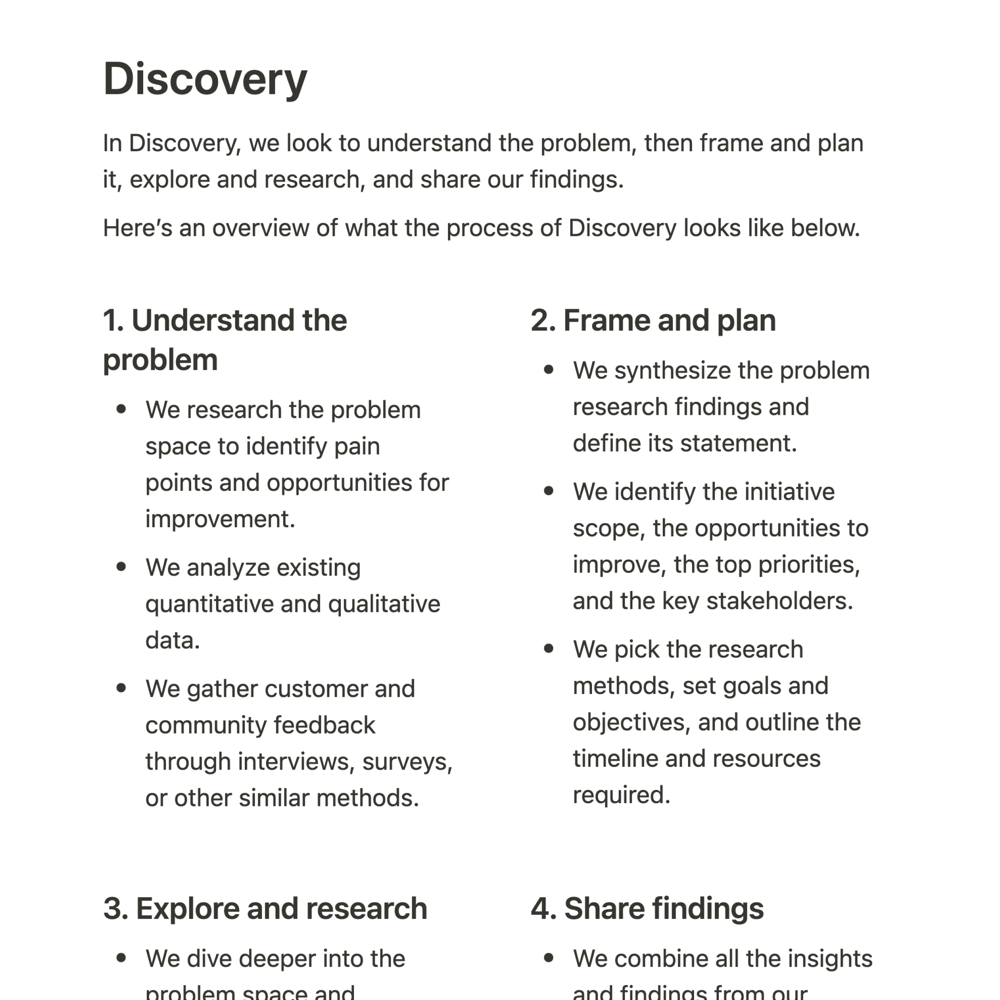
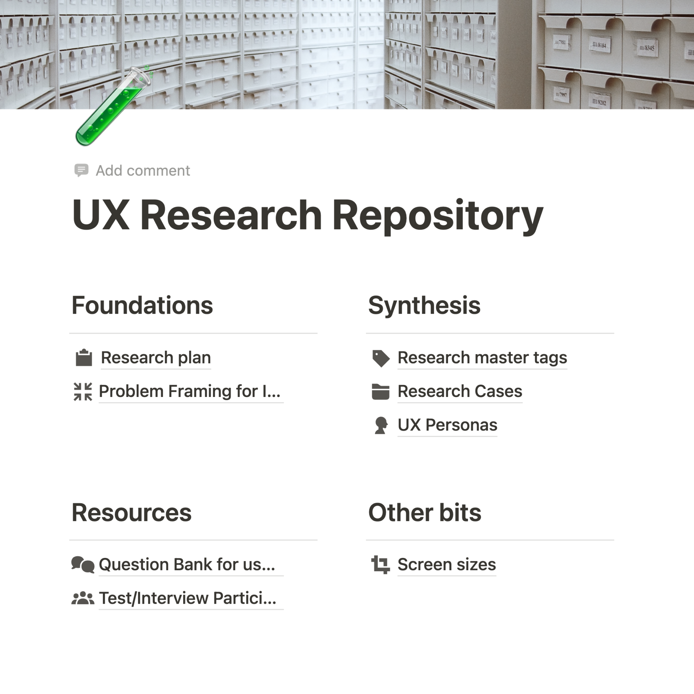
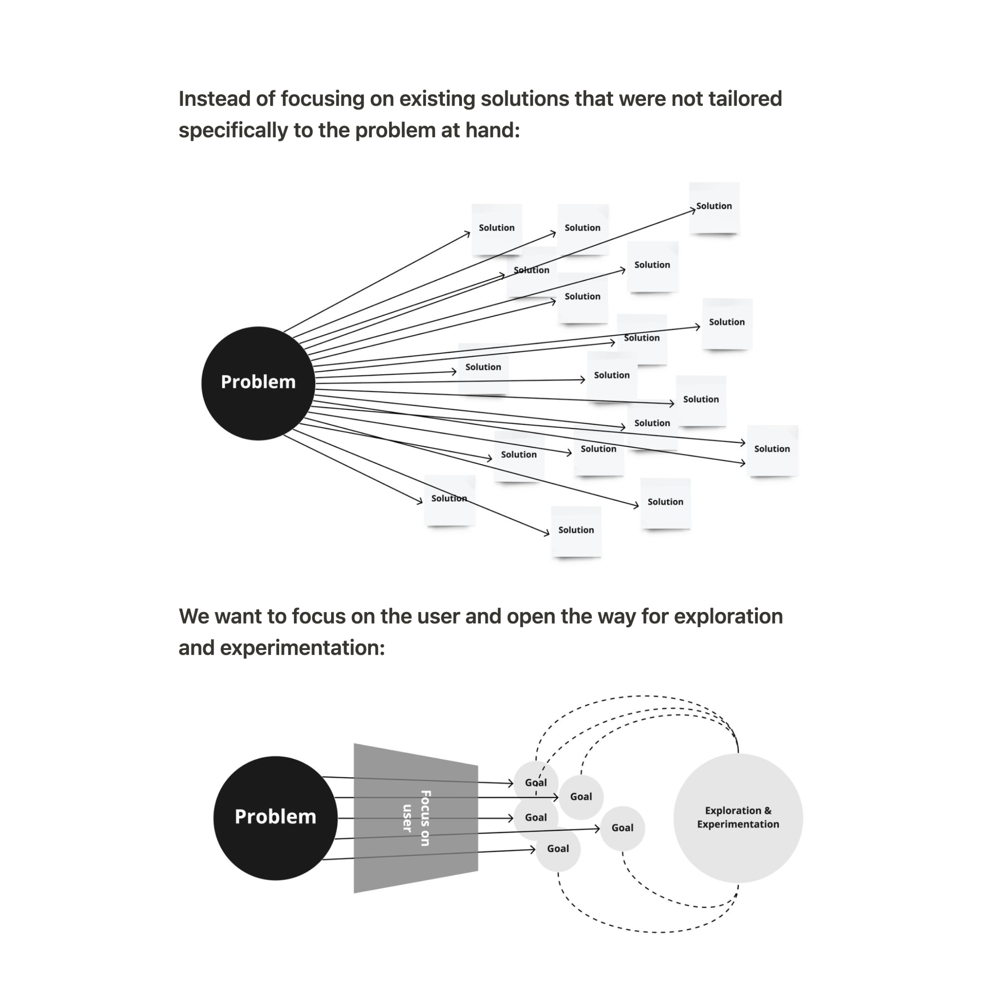
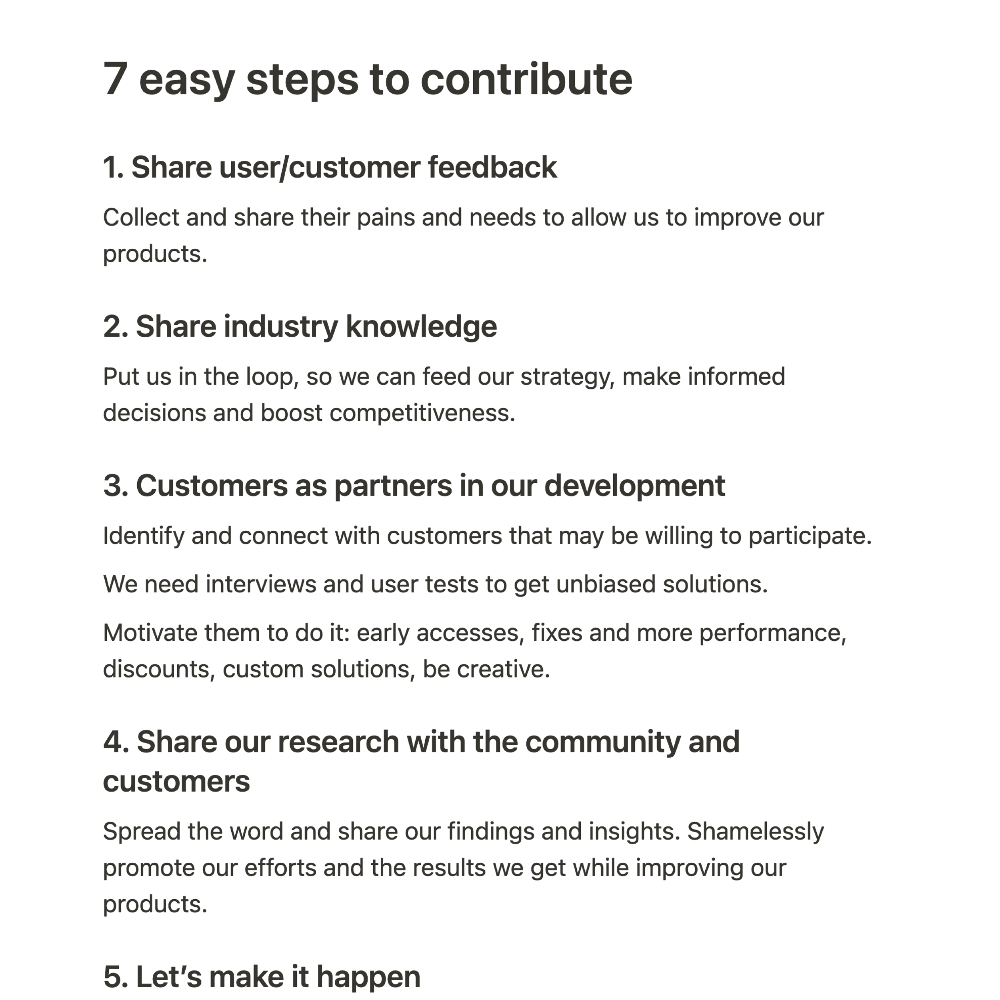
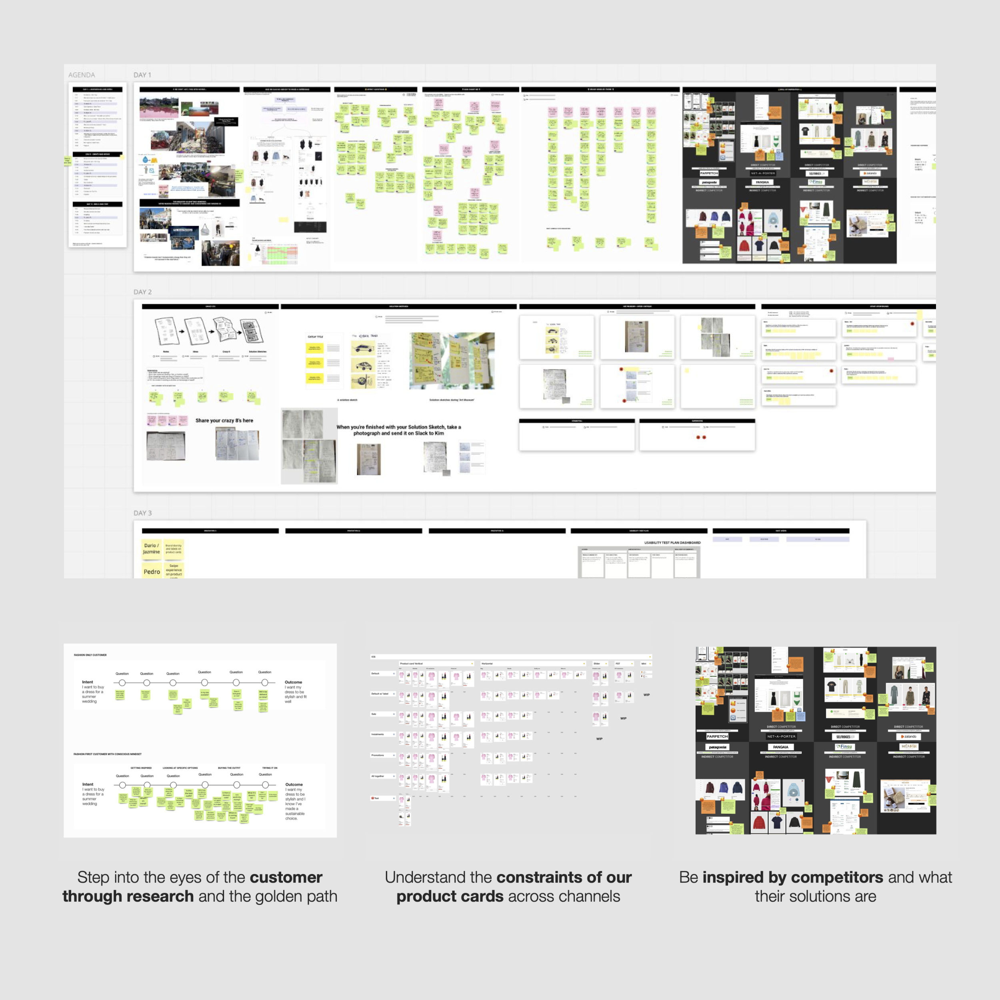

### How do you collaborate with cross-functional teams?

Communication is critical, so I get to know everyone first and expose what I do as a product designer. I suggest we set up open communication channels to push updates and exchange feedback or new intel about users and customers.

This is important when a design team is new in the company or even when a new initiative starts. Having documentation ready for this is also very important, so I condense all relevant information so everyone can get onboarded async on how design can help.

Involving the team and hosting collaborative sessions is also helpful. It's a more inclusive approach that helps everyone be hands-on, motivated, and see the value in user-centered solutions.

---

---

