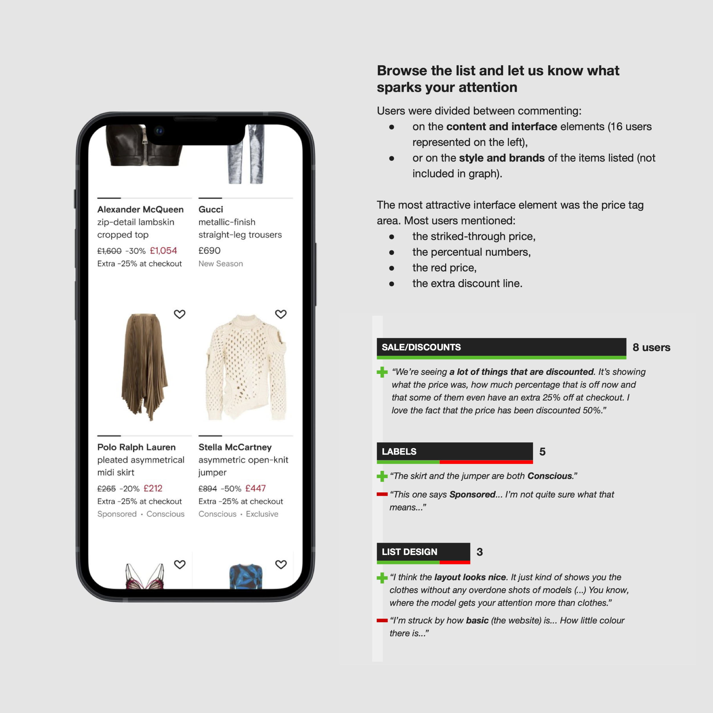
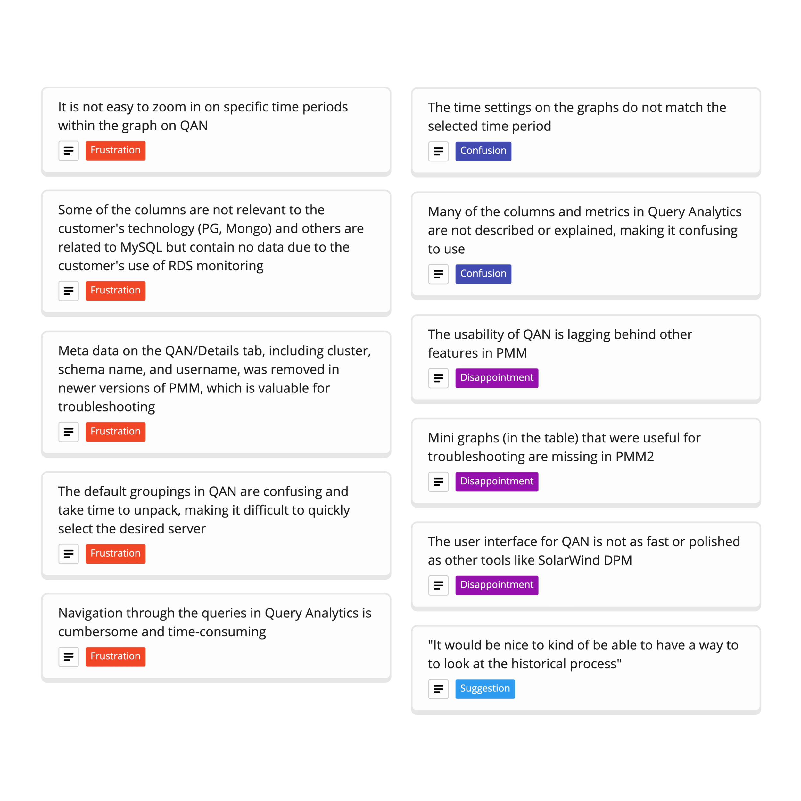
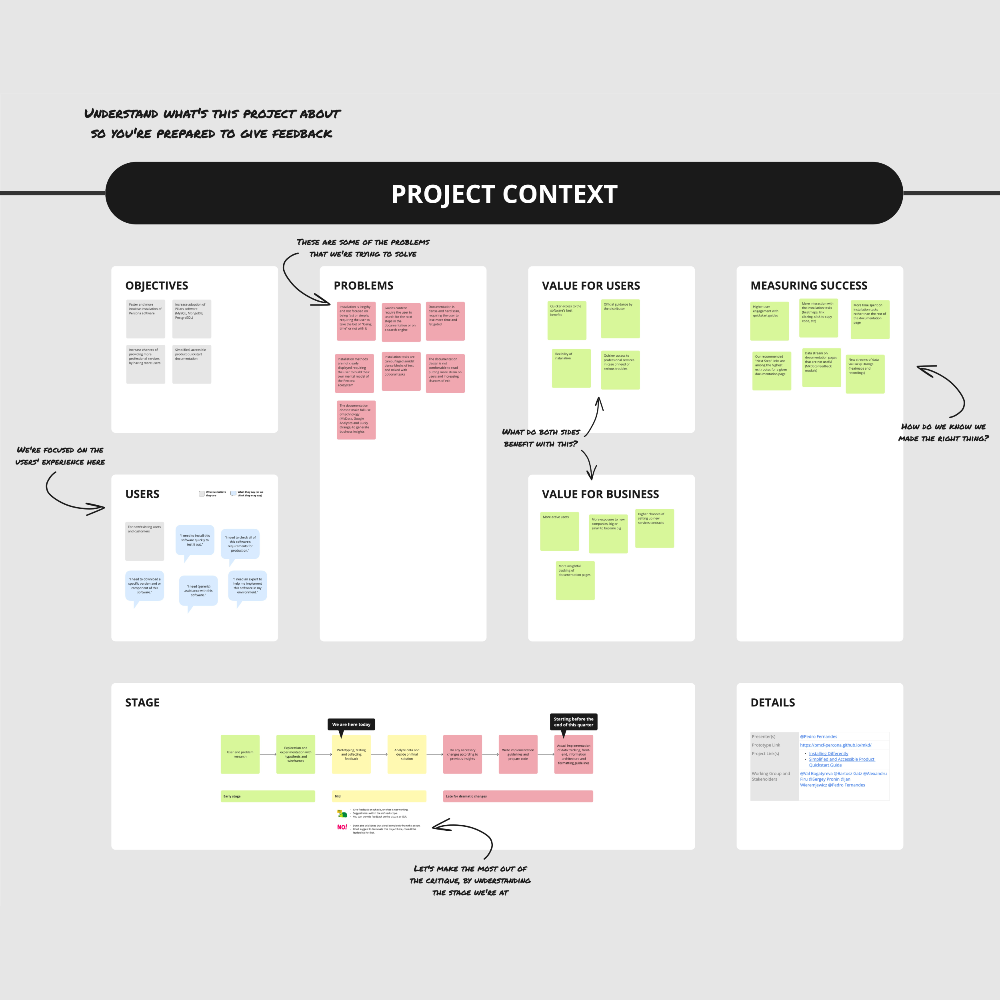
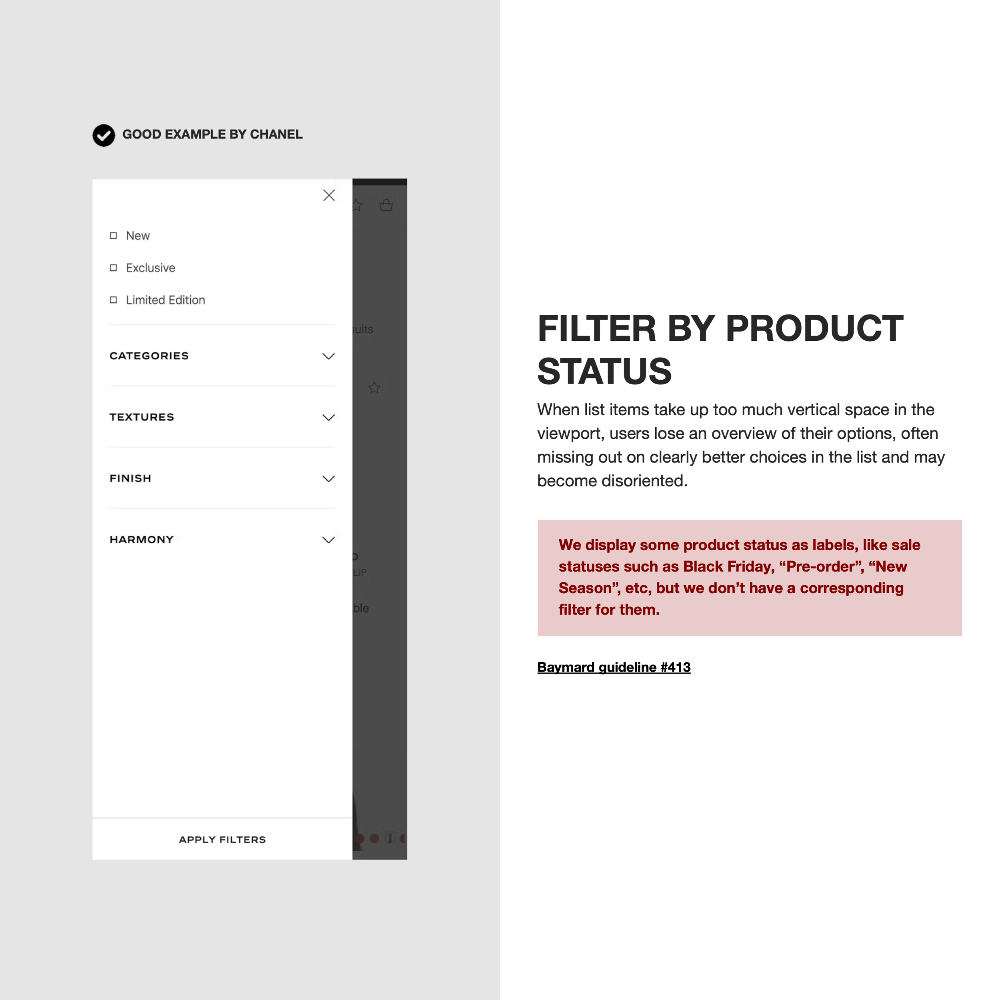
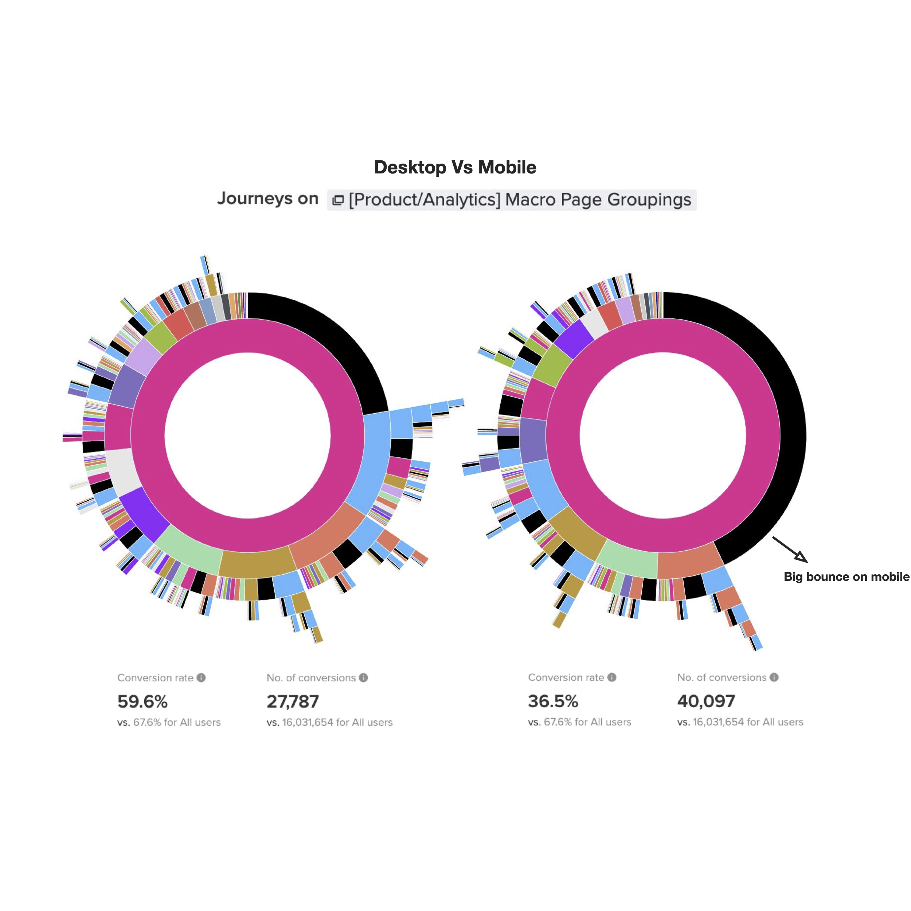
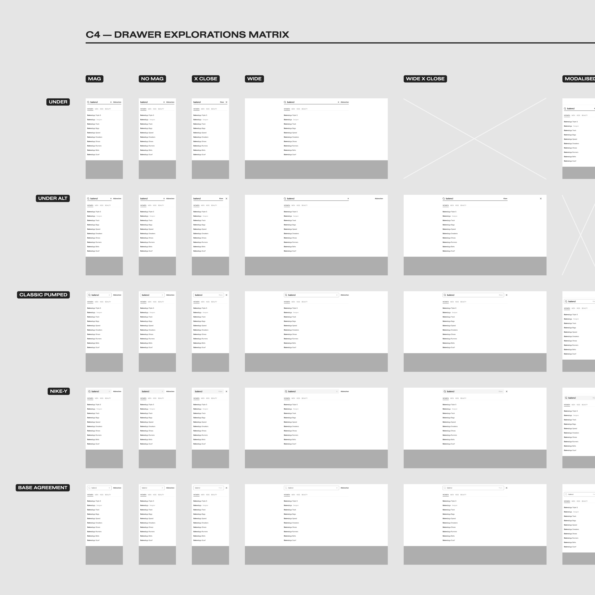

### How do you measure success?

There's a lot to choose from. User feedback and testing are critical to understanding if the solution aligns with users' needs and mitigates their problems. Usability metrics like completion/error rate can show us where to fine-tune.

Interviews and surveys with users and customers are also vital for me to get their perception and level of satisfaction. While we can assess product acceptance, it also helps us understand improvement areas.

---

I value design and aim to obtain pertinent metrics to evaluate its impact. This may include KPIs such as conversion rates, user engagement, and revenue. Benchmarks can also provide valuable insights into our standing compared to others and measure our transformation through design.

Having a well-documented or transparent iterative approach to the design process is also essential so everyone can see the mutation of a solution. This way, everyone can understand the value and the effort put into the operation.

