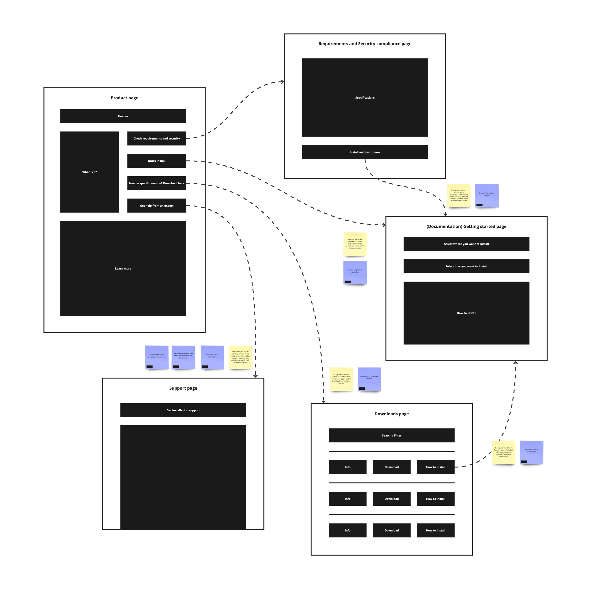
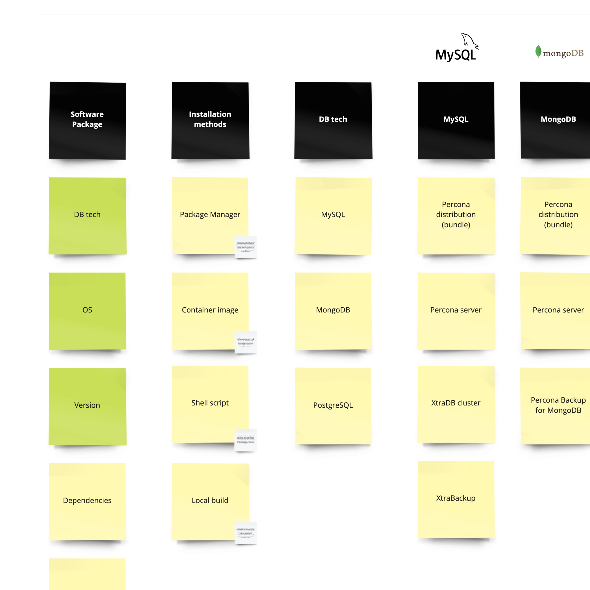
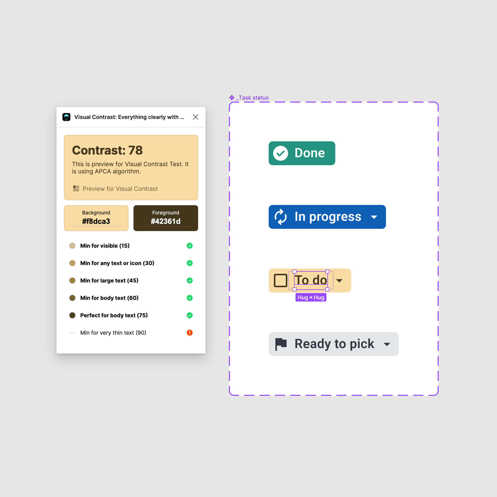
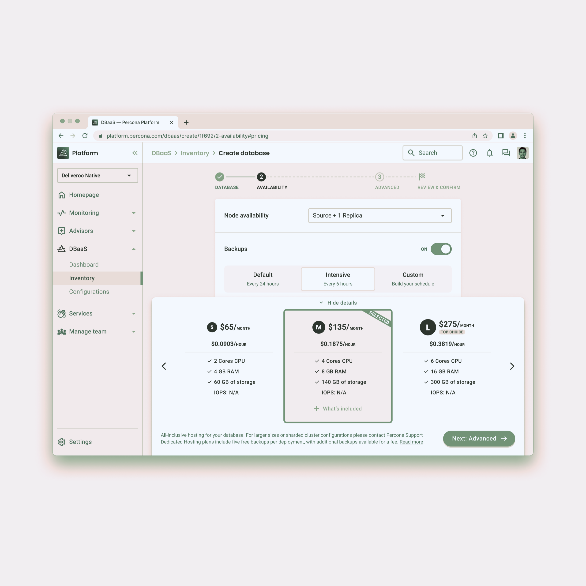
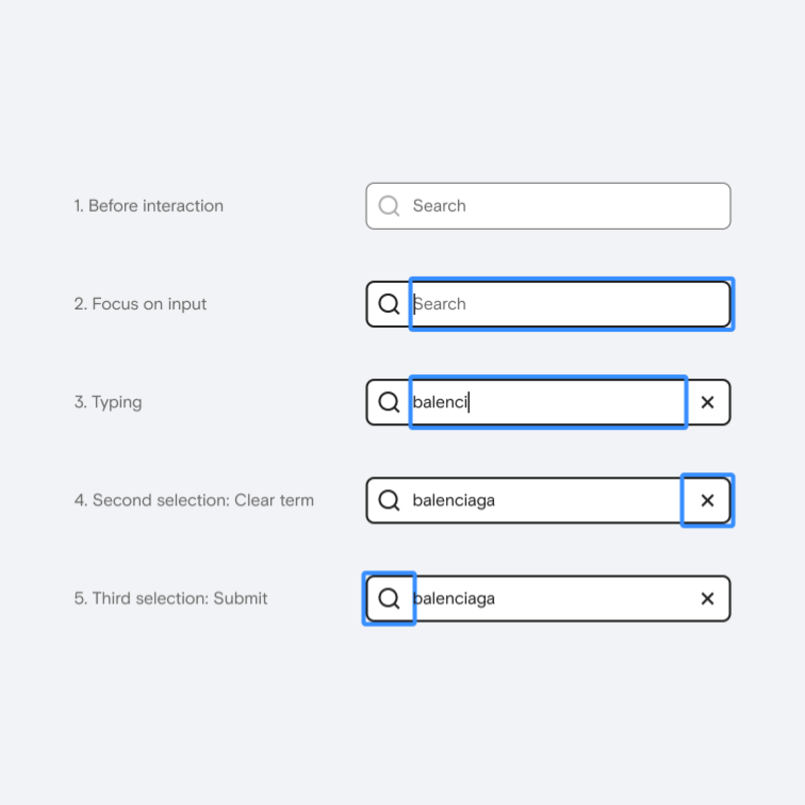

### How do you design for inclusivity?

I aim to ensure everyone can enjoy life, regardless of their abilities, disabilities, or unique needs. The best I can do is to be mindful of their experiences and infuse inclusive design principles into my work.

During user research, I make it a point to engage with individuals from diverse cultural backgrounds and age groups while including underrepresented groups to ensure a fair and balanced assessment.

One thing here I think I need to improve is collaborating with experts in accessibility and inclusivity to get insights and feedback on my designs. And I also need to educate myself more, infuse this knowledge into my process, and share it with the team.

---

I follow established guidelines like WCAG to ensure my designs meet accessibility standards. I mainly consider how hierarchy and color are perceived, how effective the keyboard is on the app and overall compatibility with assistive technologies.

