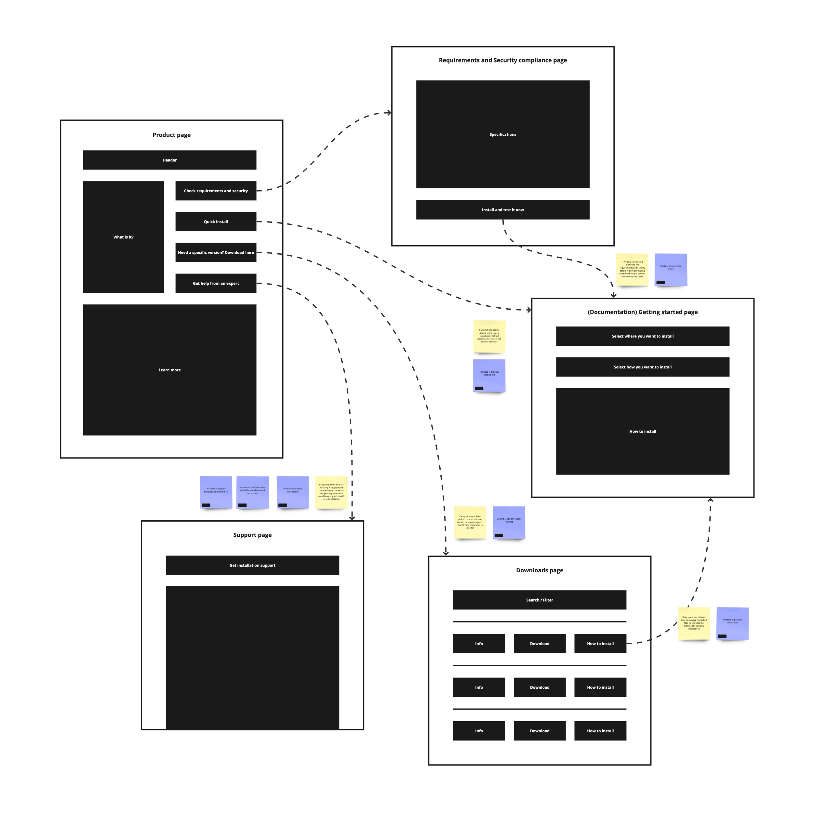
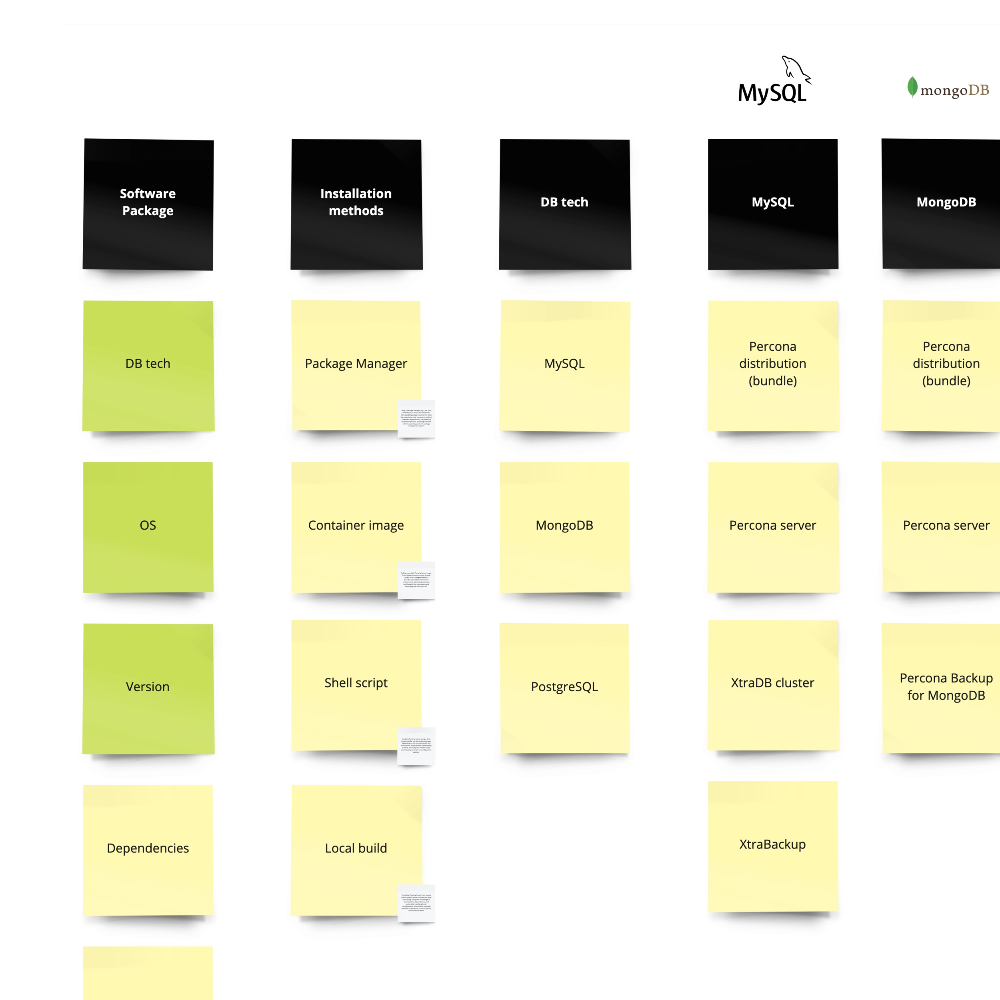
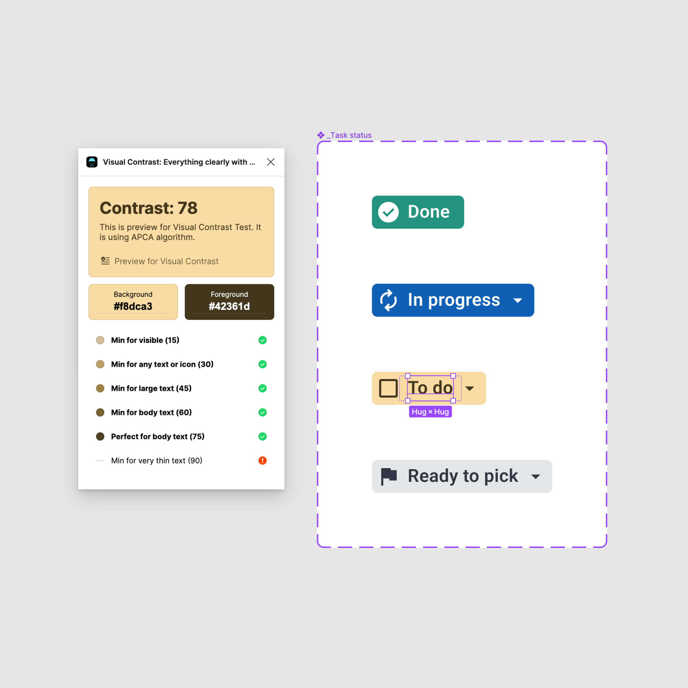
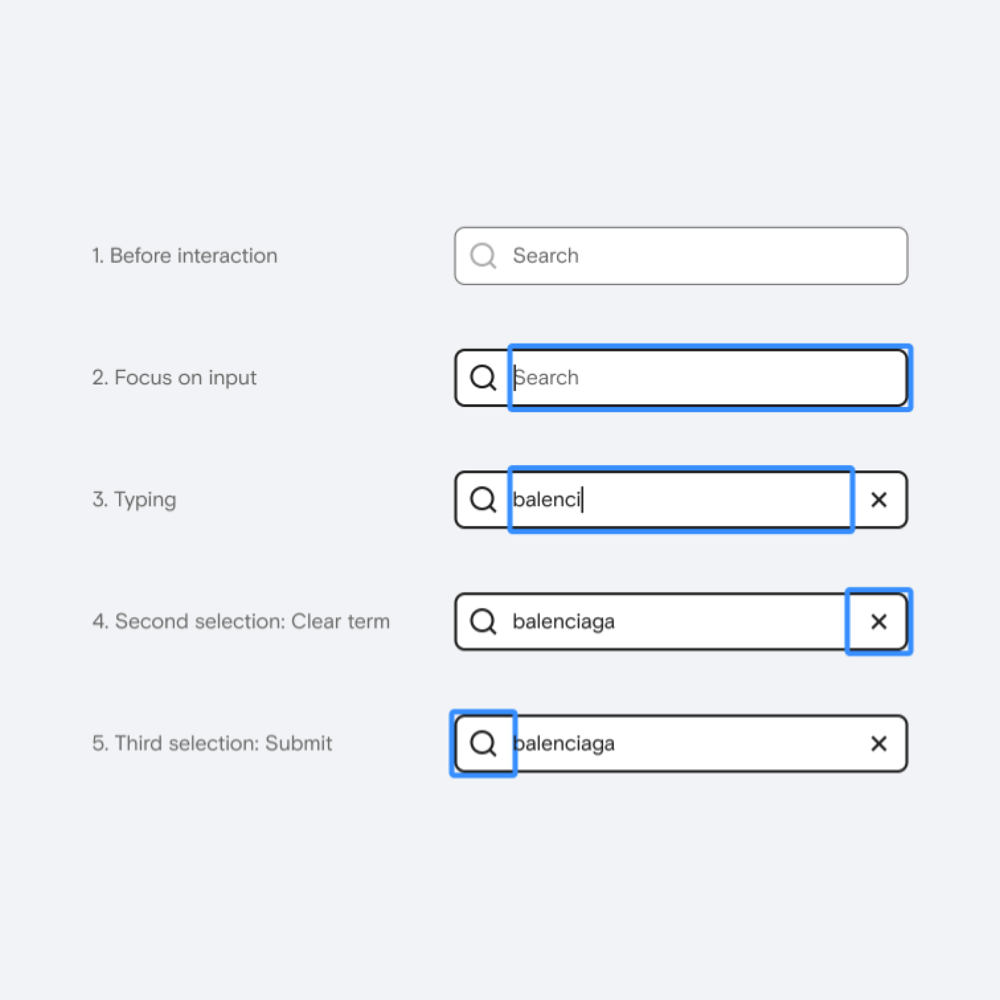

### How do you design for inclusivity?

To me, being inclusive in UX design is about including as many people as possible in enjoying life, regardless of their abilities, disabilities, or diverse needs. The best I can do is to be mindful of their experiences and incorporate inclusive design principles in my work.

When doing user research, I try to engage with individuals with different cultural backgrounds and varying ages and include underrepresented groups to make a fair assessment.

One thing here I think I need to improve is collaborating with experts in accessibility and inclusivity to gain insights and feedback on my designs. And I also need to educate myself more, infuse this knowledge into my process, and share it with the team.

---

I follow established guidelines like WCAG to ensure my designs meet accessibility standards. I consider color contrast, keyboard navigation, screen reader compatibility, and assistive technology support.

