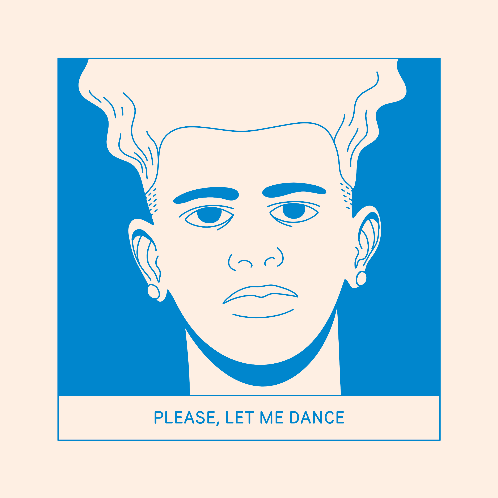

### How do you balance personal and professional life?

It isn't easy to separate. It's always the same person, right? There are no illusions here; work is necessary today. I tend to become too enthralled with ideas. The excitement of getting into a new idea pulls me in very quickly.

To be focused on what matters, I go outside to breathe fresh air, spend time with the family, drink the occasional warm beverage, and listen to tranquil music.

---

I also dedicate some time to art projects that help me de-stress. I like creating stories and experimental narratives through comic book art.

