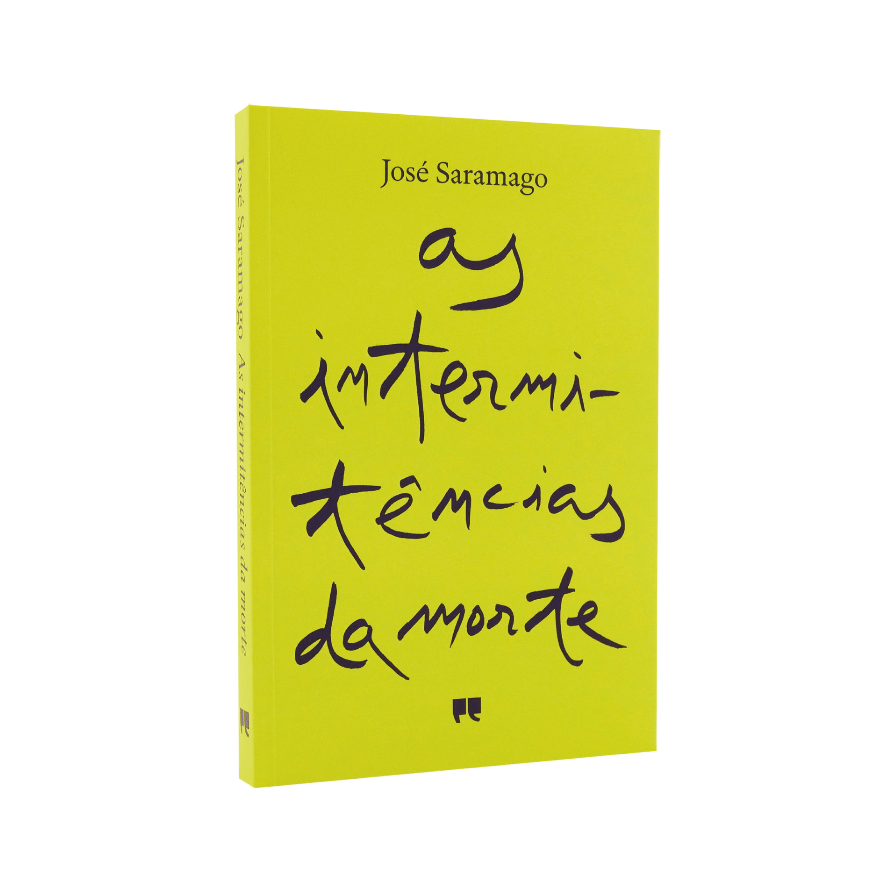

### What’s your favorite book?

Can't-restrict-to-just-one cliché. I prefer comic books. They’re very relaxing. I like Jaime Hernandez, Ulli Lust, Olivier Schrauwen, Maria Medem, Nick Drnaso, and many others.

On the prose side, I don't read much, but I loved reading “Death with Interruptions” by José Saramago. Also liked Stanisław Lem, George Orwell, and Dostoevsky.

