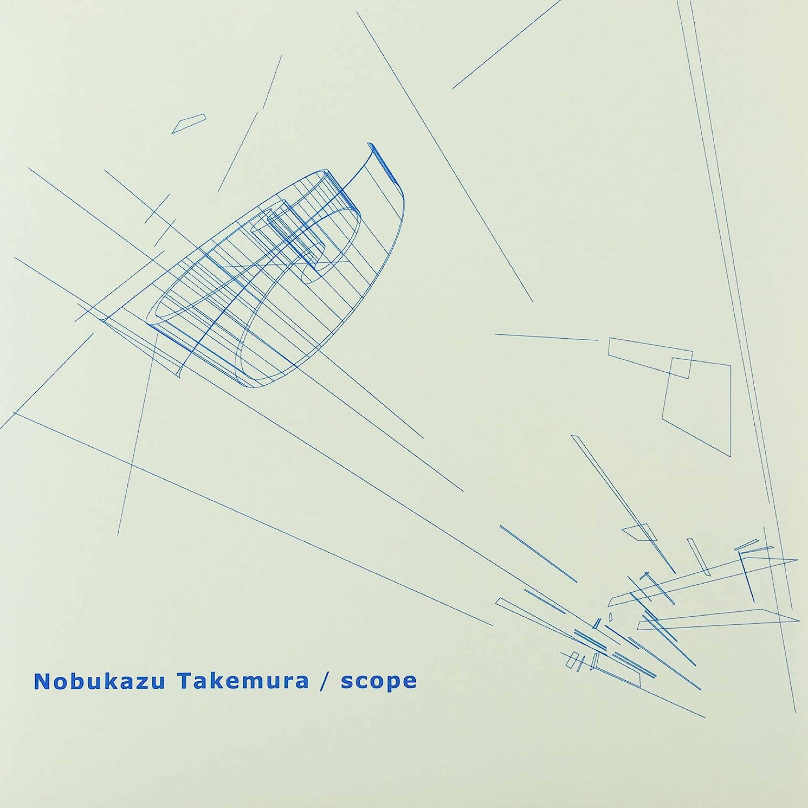

### Favorite music?

I have a shivering, trance-like experience whenever I listen to “Scope” by Nobukazu Takemura, “94 Diskont” by Oval, also Jon Hassell, Brian Eno, Cocteau Twins... The list could go on, but these names frequently come to mind.

