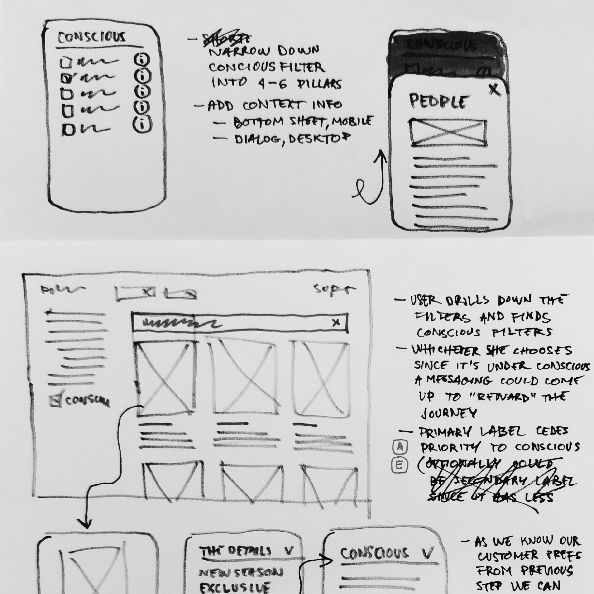
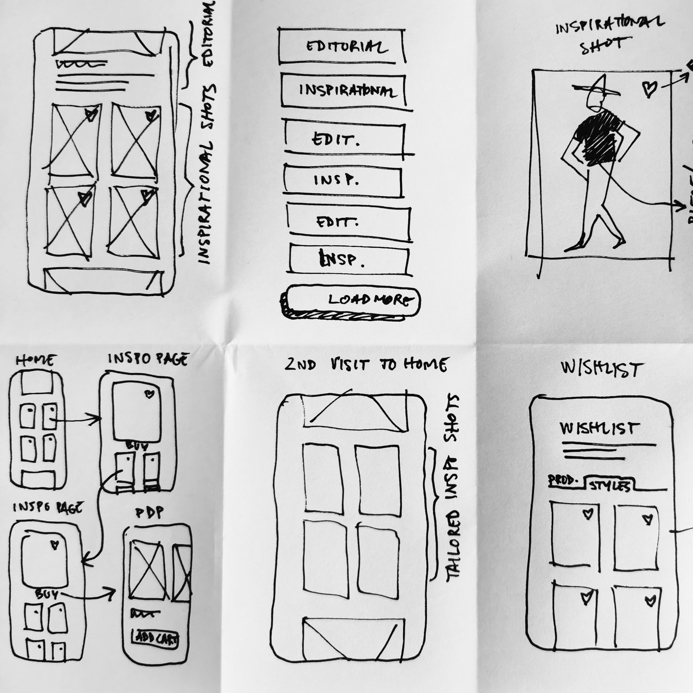

### Why are you a designer?

I’m passionate about creativity. I love to create, break down problems, and have new ideas. I like discovering solutions and always get excited when they come up.

It's also natural for me. I draw and sketch a lot, and that specific skill is helpful for design. It changes the way I think and how I approach problems. It forces me to focus on the visual outcome and is a more powerful communication tool with myself and others.

---

As a kid, set design inspired me a lot. Seeing 2001 Space Odyssey, Blade Runner, Star Wars, and many others made me think I could reinvent the world. One where we think, plan, and build something new, unique, and valuable, to make our lives better.

I started with industrial and architectural design but ended up in the digital world. We face a lot of unique challenges with contemporary technology. There are many opportunities for the present and a higher responsibility to guarantee the future. I believe I can help change things for the better.