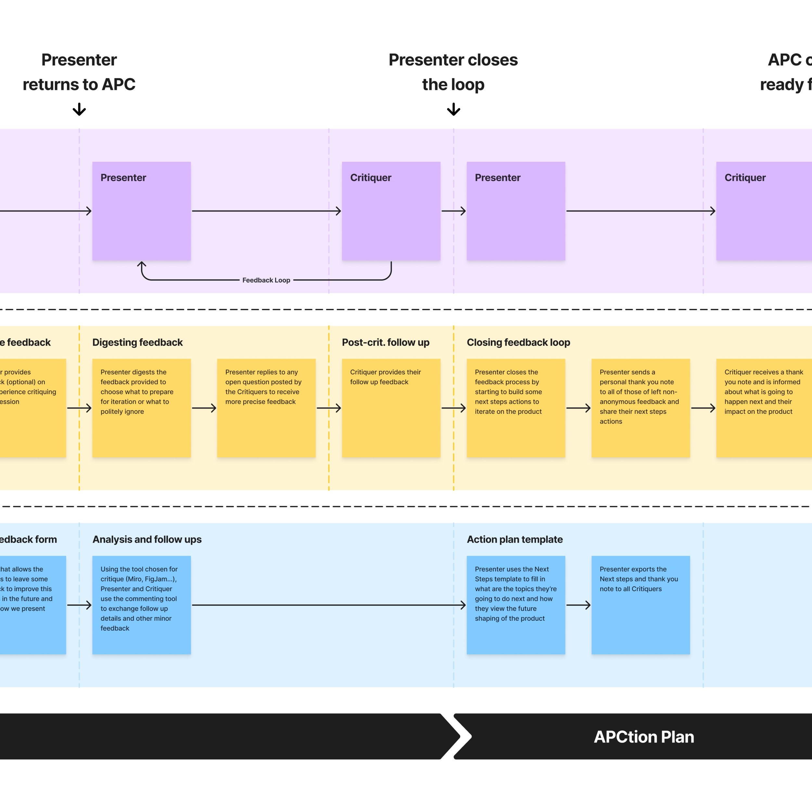

### What are some of the biggest challenges you've faced?

One challenge is keeping everyone involved and motivated to criticize and collaborate on designs. Sharing with other designers is easier, but often I need collaboration from other departments.

It works to introduce yourself, explain what you do (it's obvious to you but not to others), explain the problem space, present the associated solutions, give time to digest, and ask for feedback. It's not enough, and getting more involvement from others is essential.

I aim to work more on this and prove there's a better way to co-create and collaborate in cross-functional teams. This is one of the growth areas I'm focused on right now.

