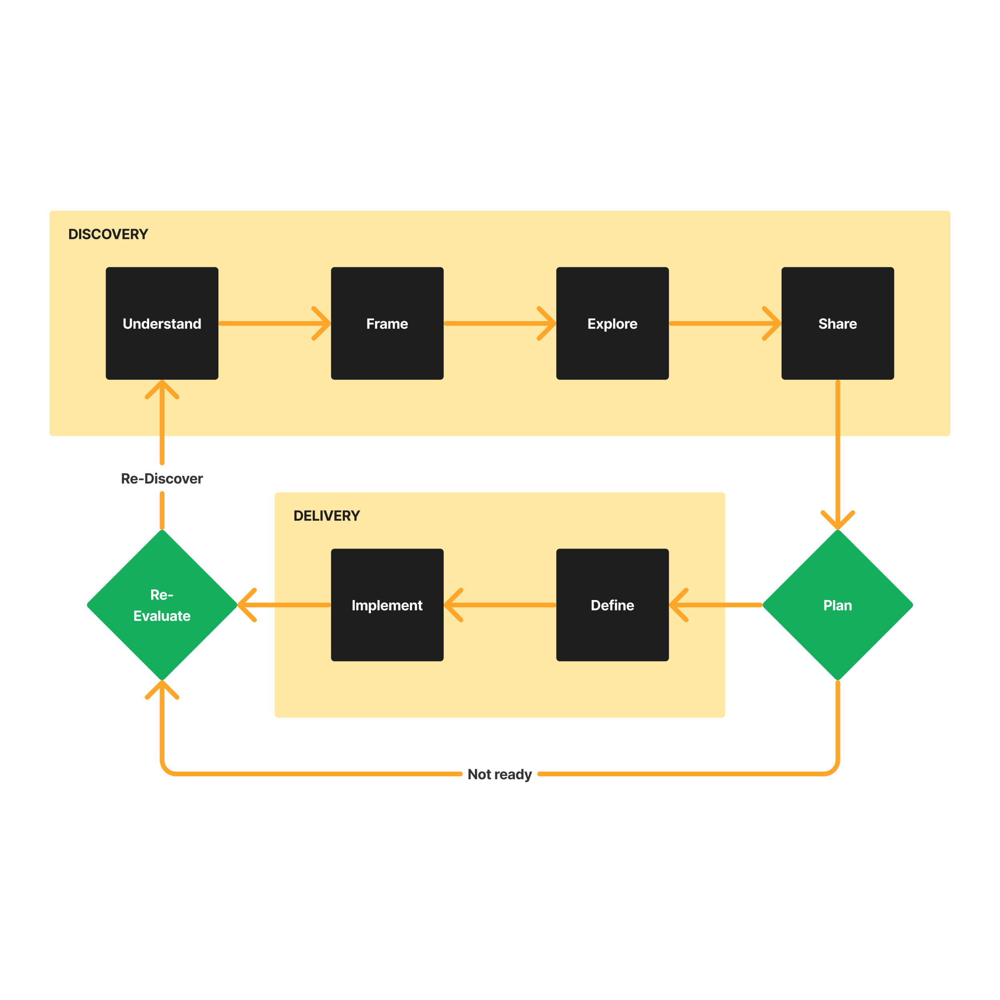

### How do you approach the design process?

Ideally, I like to follow a documented process. I think it’s a gift we can strategize and create solutions methodically. I like to admire other methodologies, learn how they work, and use them where possible.

But going by the book is not always possible, so I improvise where needed. Having experience helps, and I can anticipate where we can cut corners. Different problems require different approaches, and I try to pay attention and be open to change for better outcomes.

