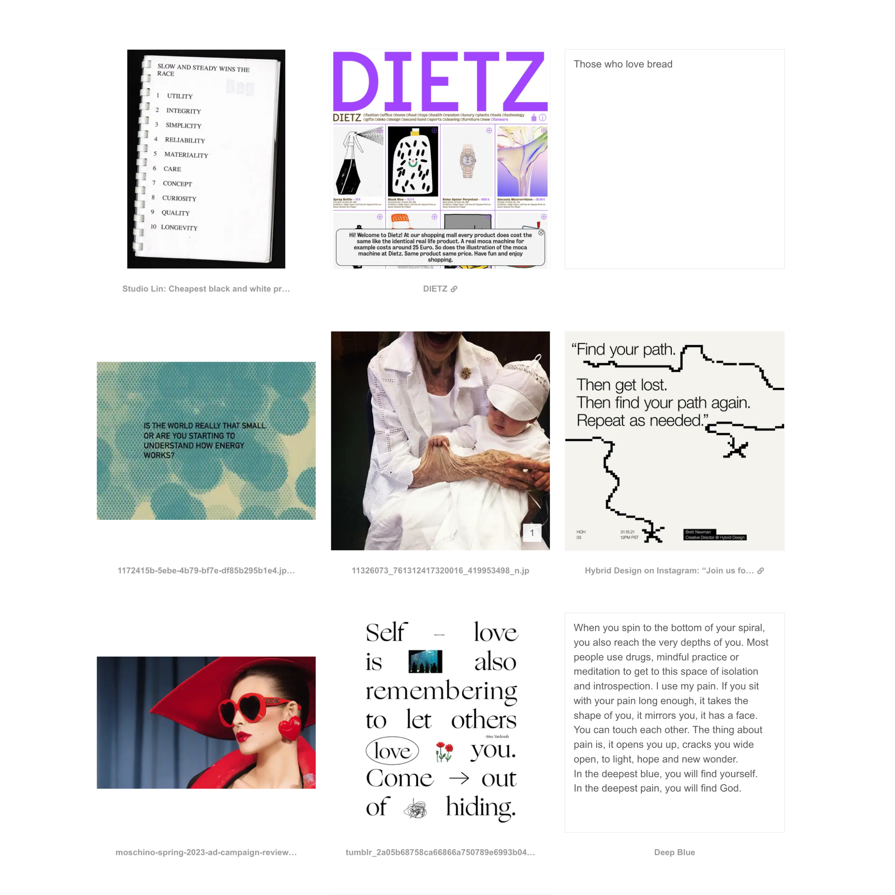
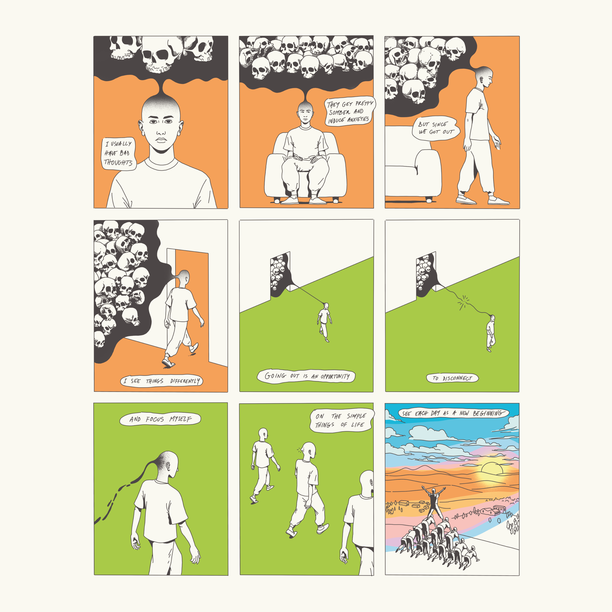

### How do you stay active and interact with the community?

Due to family needs and time constraints, I do my best to participate in events, but primarily online or I get async insights. I get news, tools, and techniques from LinkedIn, newsletters, and some key websites, but I don't put too much pressure on it.

I don't interact much with the design community. I watch and read from afar. I occasionally contribute to some communities that spark my interests and match my hobbies, like open-source, comic books, graphic design, illustration, radio, music, etc.

