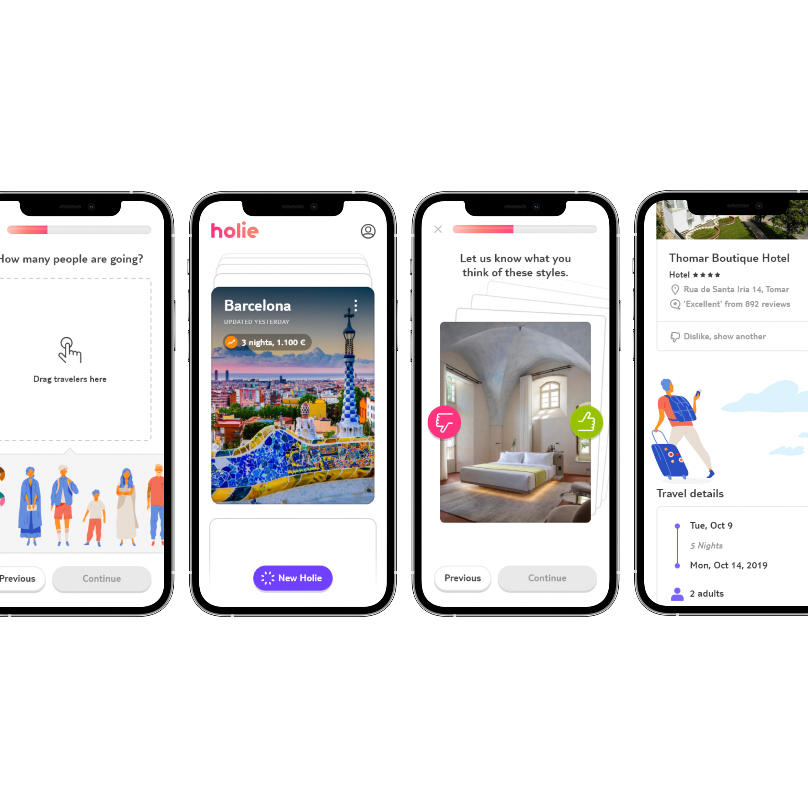
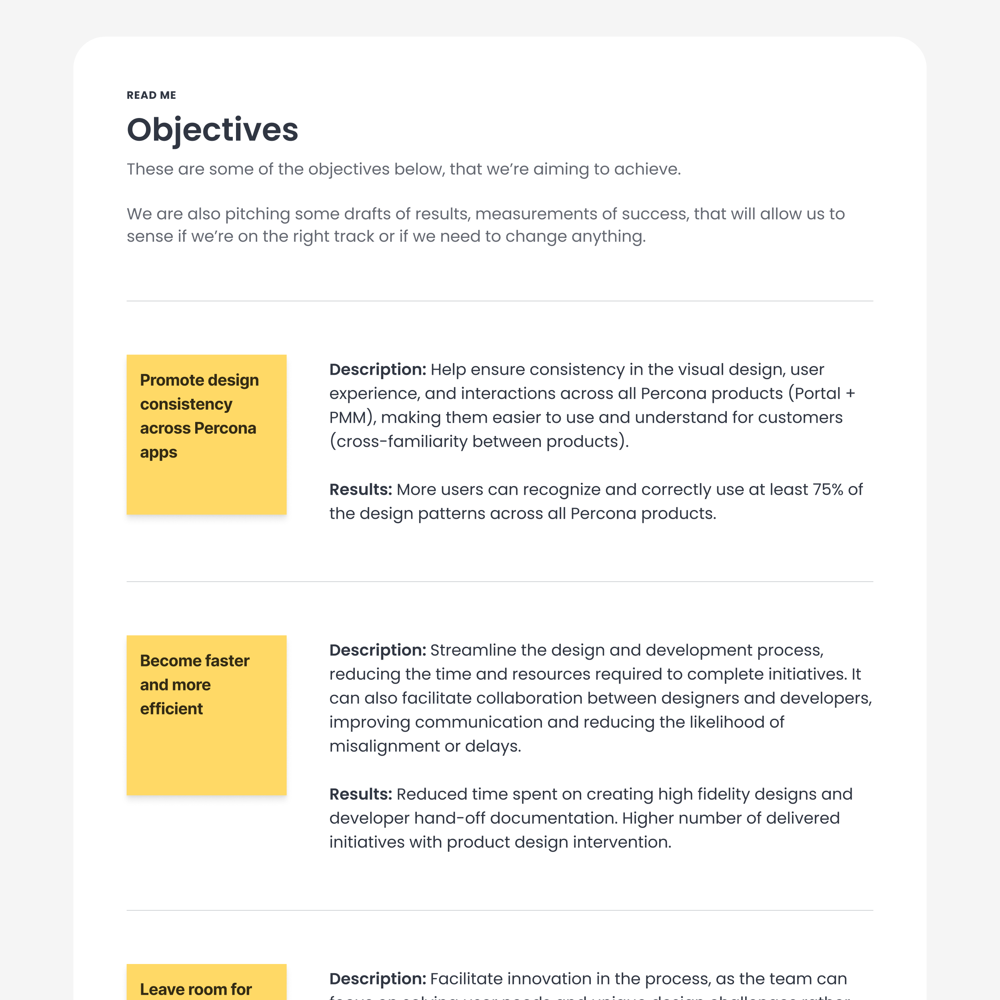
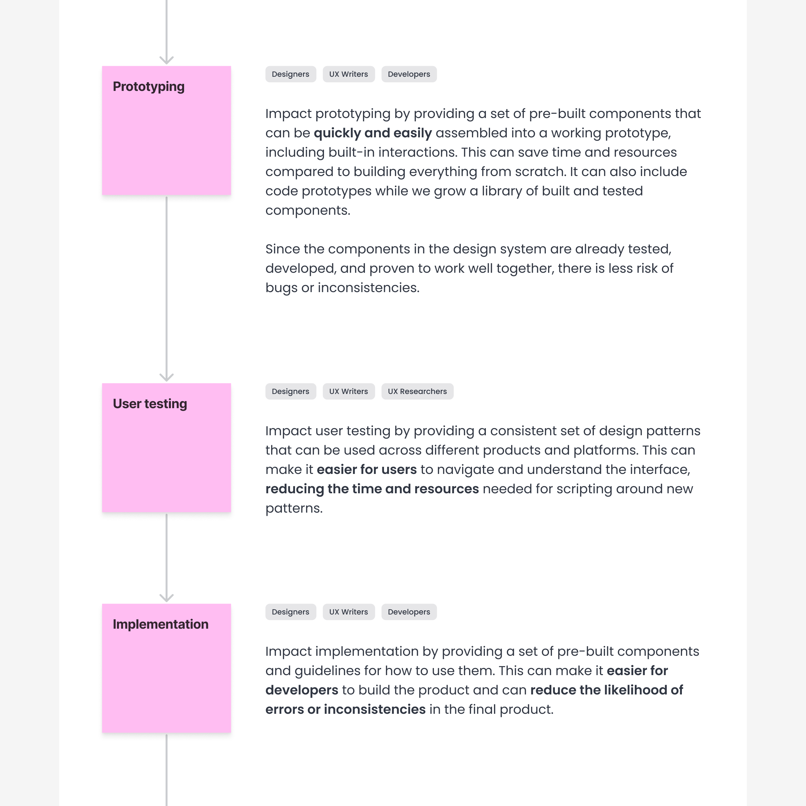
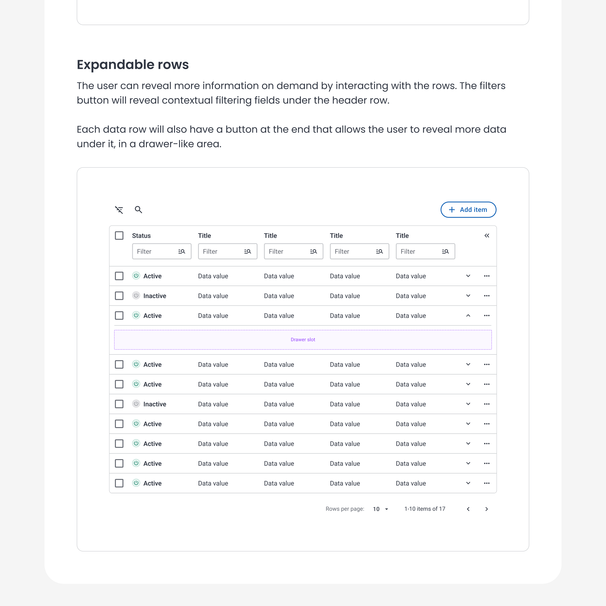
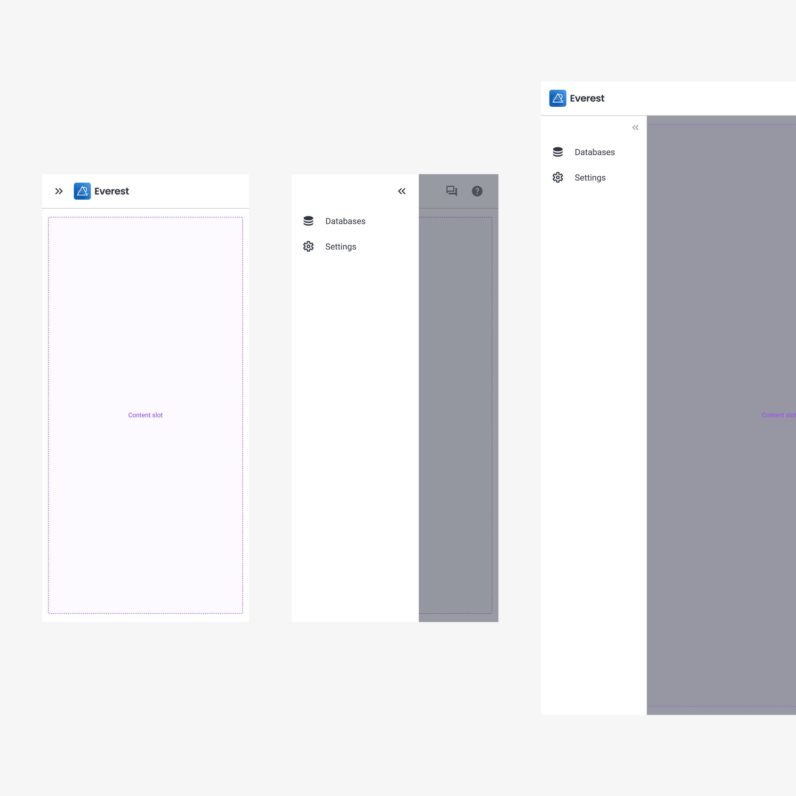
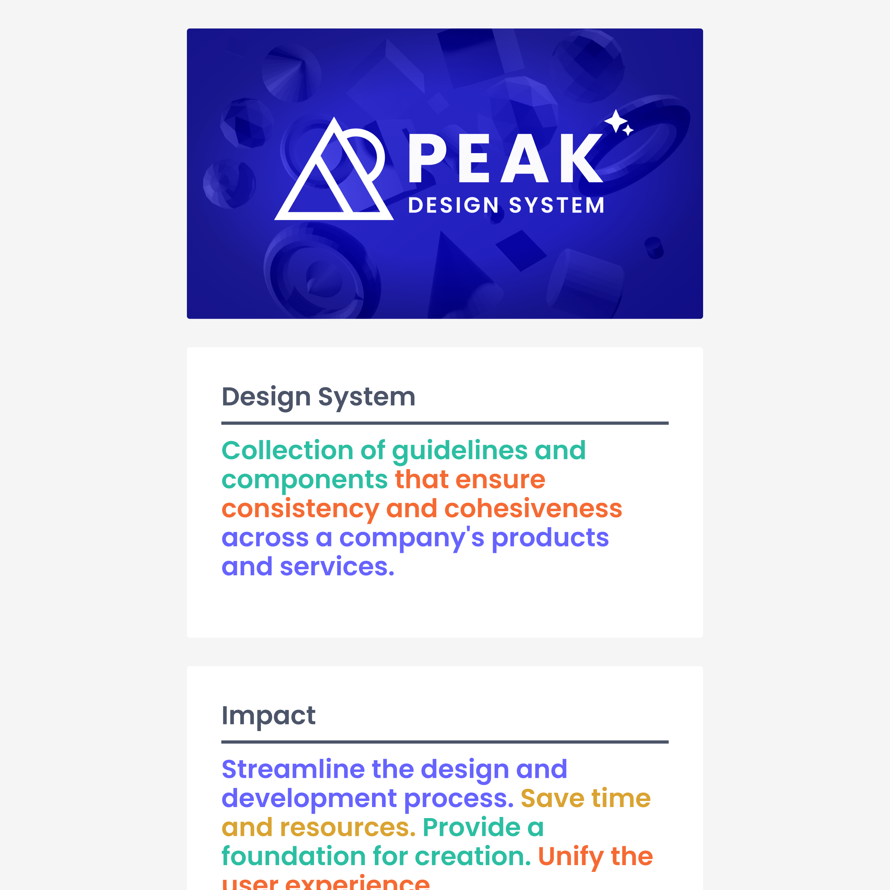
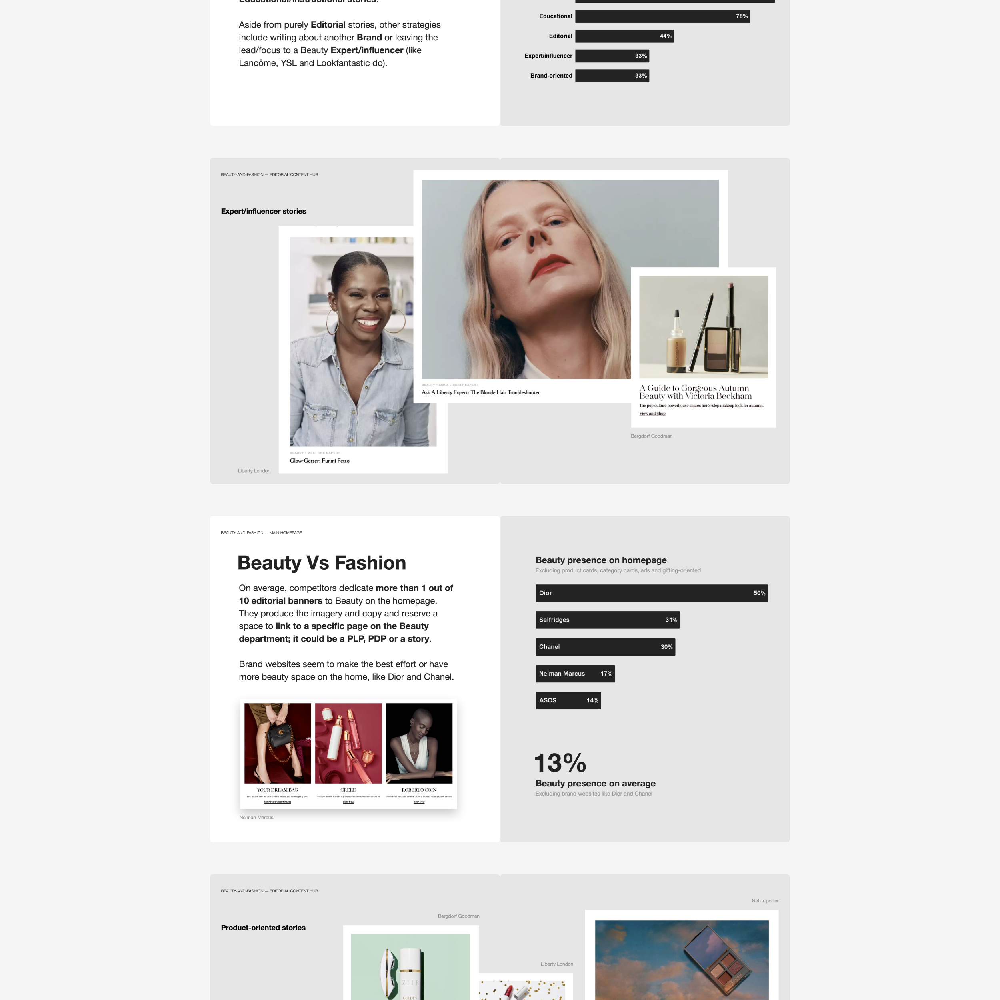

### What do you consider to be your greatest strengths?

I’m obsessed with UI “perfection,” which leads me to put extra effort into conveying ideas accurately. It's a blessing and a curse. There's the risk of overdoing it.

The experience helps me control it. Taking breaks and switching tasks helps put a different perspective and reassess efforts. I'm happier with my current pace and how the results improve and come out with less effort with more maturity.

---

This extends to my modularization obsessions. I love optimizing my files, either designs, references, or code, so they are as centralized as possible to save me from repetitive work and iterate faster in the long run.

---

I also believe I’m a decent presenter. I’ve honed my skills for a while. I stopped stuttering, sweating profusely, and I no longer tremble, I think... Paired with "stunning" visuals... I can convince anyone my ideas are the best!

