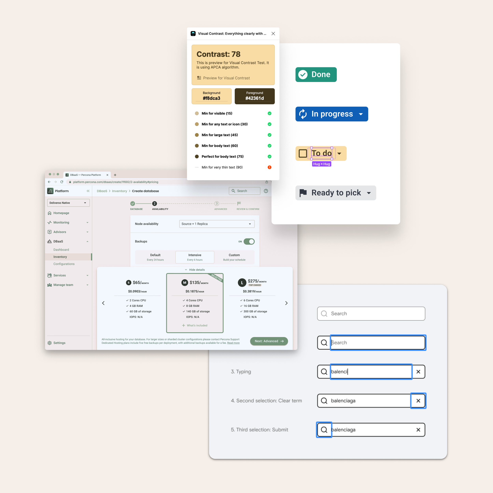

It has been a no-brainer step in my process. Benchmarking outputs act as a compass to understand key differentiators so we can adjust, as a team, our design strategy.

By looking into the competitive landscape, I aim to help the team identify opportunities that ensure we're carving out our own distinct space in the industry. This exercise lays a solid foundation for informed decision-making.