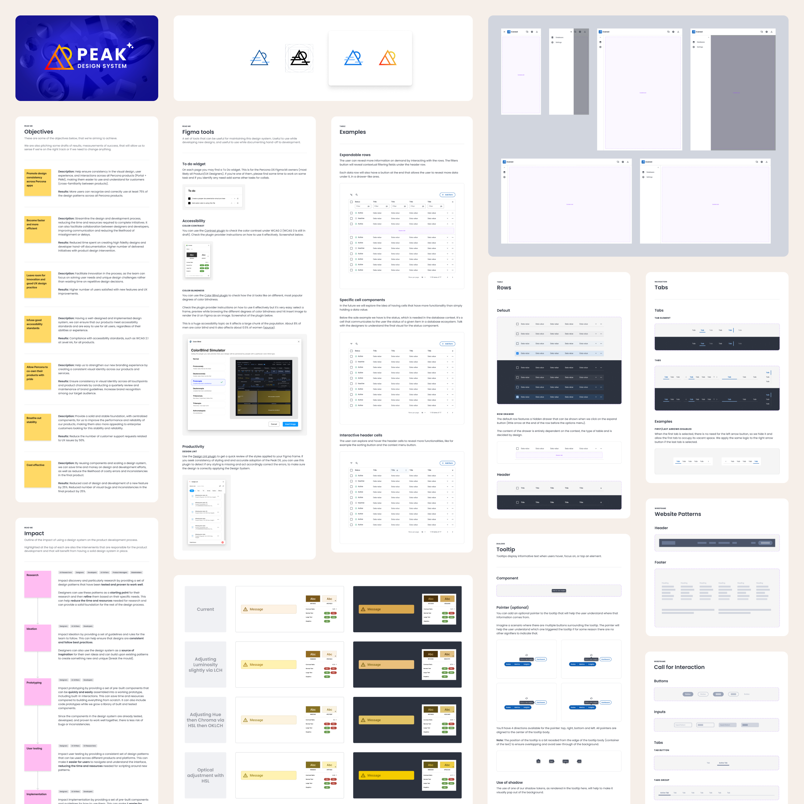

I've been dedicated to design systems for a long time. The Lego-like experience and systematization draws me in.

I have built three design systems for web interfaces from scratch. For the first one, I had to go through the whole flow of setting it up, designing, coding, and testing — learning how to — so it would be ready to use.

At TUI Group and Percona, I had to set up a more robust and scalable documentation schema. And at Farfetch, I had the chance to contribute to their design system by complying with demanding bureaucracy and elevated implementation risk.

So far, I've learned how invaluable a design system is to grease the design machine and move faster and an innovative company. My experience here can benefit teams looking to build impactful experiences and brands that scale with minimal regressions.