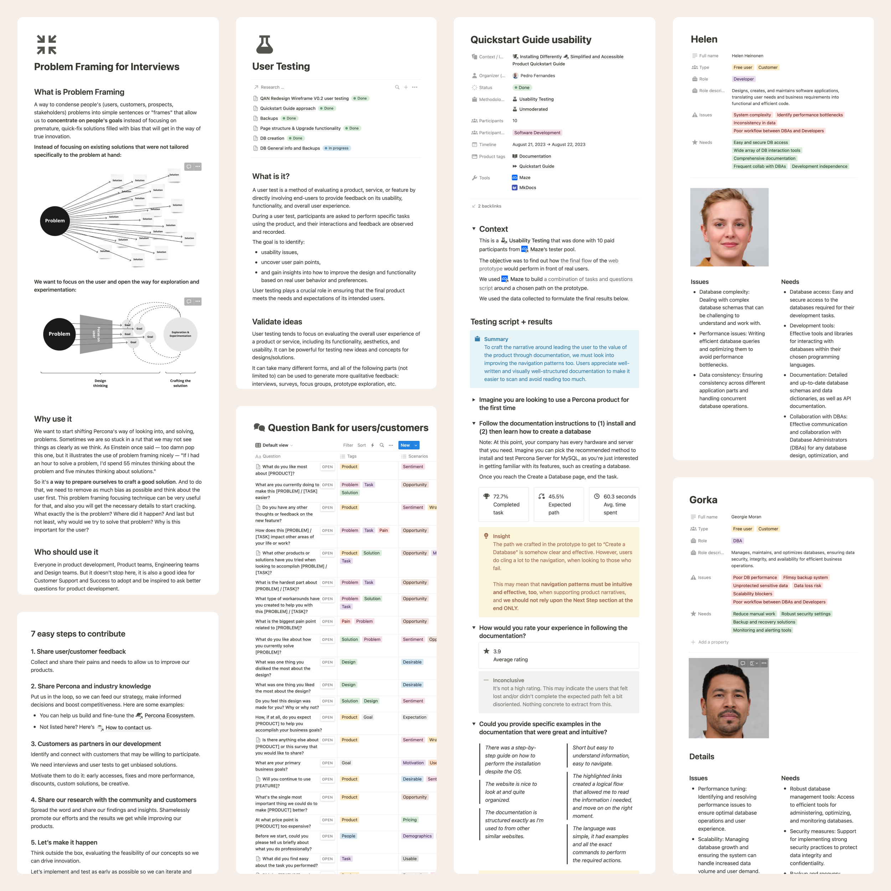

I've been dedicated to design systems. The Lego-like experience and systematization draws me in.

I have built three design systems for web interfaces from scratch. For the first one, I had to go through the whole flow of setting it up, designing it, coding, and testing it — learning how not to do it — so it would be ready to plug into the backend framework.

At TUI Group and Percona, I had to set up a more robust documentation schema that would grow and shape with the initiatives. And at Farfetch, I had the chance to contribute to their design system by complying with demanding bureaucracy and elevated implementation risk.

I've learned how invaluable a design system is to grease the design machine and move faster. My experience here can benefit teams looking to build impactful experiences and brands that scale with minimal regressions.