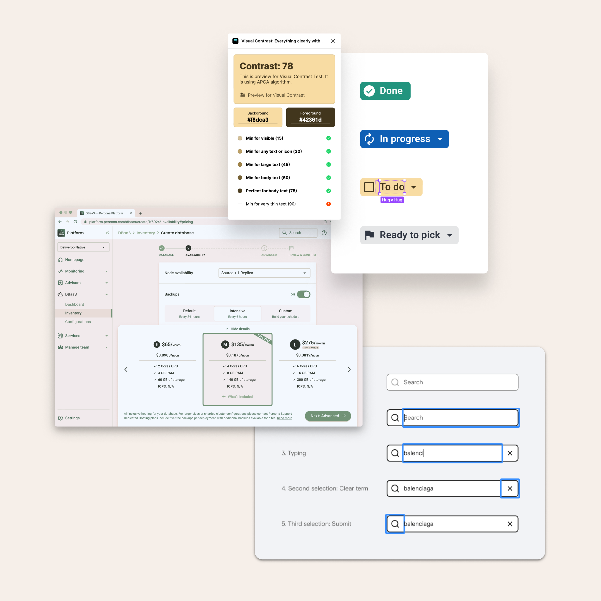

Like a detective, I search high and low, left and right, across all departments to find the root problems we face on a given initiative.

I arrange collaborative and dynamic sessions with a small group of colleagues, including users or customers, to gather relevant leads. The main objective is to collect and condense evidence and formulate valuable insights for the work ahead. I help unveil nuanced user needs, aligning our design solutions more closely with real-world user experiences.