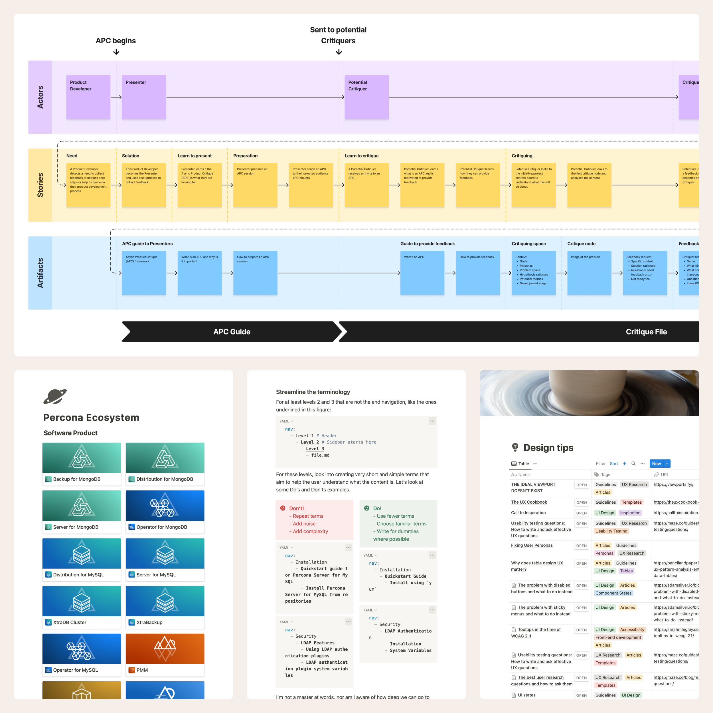

Working with a concerted team is great. My schematization and documentation skills can help accomplish this. I look into opportunities to improve workflows that make work more pleasurable and productive.

I like structured, systematized work, so I develop design systems contribution workflows, design critique templates, documentation templates, workflow signage, and more, anything that may be needed.

I also like to research and be on the lookout for tools, references, heuristic strategies, best practices, toolkits, templates, and other things that come in handy to make design work more focused and efficient.